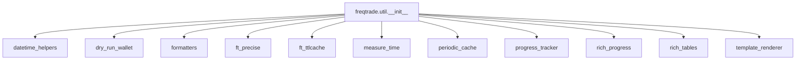

# __init__.py

## 概述
`freqtrade/util/__init__.py` 是 `freqtrade.util` 包的入口文件，负责将 util 子模块中的核心工具函数和类统一导出，方便项目其他模块通过 `from freqtrade.util import xxx` 的方式直接使用。

## 架构图

## 导出内容

### 从 `datetime_helpers` 导出
- `dt_floor_day`, `dt_from_ts`, `dt_humanize_delta`, `dt_now`, `dt_ts`, `dt_ts_def`, `dt_ts_none`, `dt_utc` -- 时间日期处理工具
- `format_date`, `format_ms_time`, `format_ms_time_det`, `shorten_date` -- 日期格式化

### 从 `dry_run_wallet` 导出
- `get_dry_run_wallet` -- 获取模拟运行钱包余额

### 从 `formatters` 导出
- `decimals_per_coin`, `fmt_coin`, `fmt_coin2`, `format_duration`, `format_pct`, `round_value` -- 数值/币种格式化

### 从其他模块导出
- `FtPrecise` -- 高精度数学运算（来自 `ft_precise`）
- `FtTTLCache` -- 带 TTL 的缓存（来自 `ft_ttlcache`）
- `MeasureTime` -- 代码耗时测量（来自 `measure_time`）
- `PeriodicCache` -- 周期性缓存（来自 `periodic_cache`）
- `get_progress_tracker`, `retrieve_progress_tracker` -- 进度跟踪器（来自 `progress_tracker`）
- `CustomProgress` -- 自定义进度条（来自 `rich_progress`）
- `print_rich_table`, `print_df_rich_table` -- Rich 表格打印（来自 `rich_tables`）
- `render_template`, `render_template_with_fallback` -- 模板渲染（来自 `template_renderer`）

## 依赖关系

### 内部依赖（本项目模块）
- `freqtrade.util.datetime_helpers` -- 时间日期工具
- `freqtrade.util.dry_run_wallet` -- 模拟运行钱包
- `freqtrade.util.formatters` -- 格式化工具
- `freqtrade.util.ft_precise` -- 高精度计算
- `freqtrade.util.ft_ttlcache` -- TTL 缓存
- `freqtrade.util.measure_time` -- 耗时测量
- `freqtrade.util.periodic_cache` -- 周期缓存
- `freqtrade.util.progress_tracker` -- 进度跟踪
- `freqtrade.util.rich_progress` -- Rich 进度条
- `freqtrade.util.rich_tables` -- Rich 表格
- `freqtrade.util.template_renderer` -- 模板渲染

### 外部依赖（第三方库）
无直接外部依赖

### 被依赖（谁引用了本文件）
项目中几乎所有模块都通过 `from freqtrade.util import ...` 来使用这些工具，包括但不限于：
- `freqtrade.freqtradebot` -- 主交易机器人
- `freqtrade.exchange.*` -- 交易所相关模块
- `freqtrade.persistence.*` -- 持久化模块
- `freqtrade.optimize.*` -- 优化/回测模块
- `freqtrade.rpc.*` -- RPC/API 模块
- `freqtrade.plugins.*` -- 插件模块
