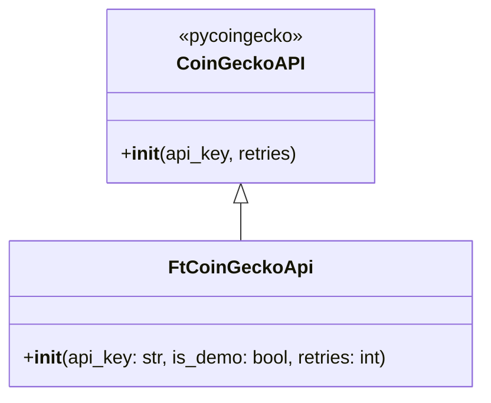

# coin_gecko.py

## 概述
`freqtrade/util/coin_gecko.py` 提供了对 `pycoingecko` 库 `CoinGeckoAPI` 的简单封装类 `FtCoinGeckoApi`，主要目的是支持 CoinGecko Demo API Key，使 Freqtrade 能方便地调用 CoinGecko 的加密货币数据接口。

## 架构图

## 核心类/函数

### FtCoinGeckoApi
继承自 `pycoingecko.CoinGeckoAPI`，是 CoinGecko API 的轻量级封装。

**构造参数：**
- `api_key: str = ""` -- CoinGecko API 密钥，默认为空
- `is_demo: bool = True` -- 是否使用 Demo API Key（关键字参数），默认为 `True`
- `retries: int = 5` -- API 请求失败时的重试次数

**关键逻辑：**
- 当 `api_key` 非空且 `is_demo=True` 时，将 API Key 作为 `demo_api_key` 传给父类，使用 CoinGecko 免费 Demo 端点
- 当 `is_demo=False` 时，将 `api_key` 作为正式的付费 API Key 传给父类

## 依赖关系

### 内部依赖（本项目模块）
无

### 外部依赖（第三方库）
- `pycoingecko` -- CoinGecko API 的 Python 客户端库

### 被依赖（谁引用了本文件）
- `freqtrade.rpc.fiat_convert` -- 法币转换模块，使用 CoinGecko 获取加密货币价格
- `freqtrade.plugins.pairlist.MarketCapPairList` -- 市值排序交易对列表插件
