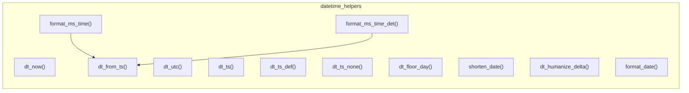

# datetime_helpers.py

## 概述
`freqtrade/util/datetime_helpers.py` 是 Freqtrade 项目中最常用的工具模块之一，提供了一整套 UTC 时间日期处理函数。所有函数都围绕 UTC 时区工作，确保项目中时间处理的一致性。功能包括：获取当前 UTC 时间、构造 UTC datetime 对象、datetime 与毫秒级时间戳互转、日期格式化、日期人性化显示等。

## 架构图

## 核心类/函数

### dt_now() -> datetime
返回当前 UTC 时间的 `datetime` 对象。

### dt_utc(year, month, day, hour=0, minute=0, second=0, microsecond=0) -> datetime
构造一个 UTC 时区的 `datetime` 对象。所有时间分量均可指定。

### dt_ts(dt: datetime | None = None) -> int
将 `datetime` 转换为毫秒级 Unix 时间戳。如果 `dt` 为 `None`，返回当前时间的毫秒时间戳。

### dt_ts_def(dt: datetime | None, default: int = 0) -> int
将 `datetime` 转换为毫秒级时间戳。如果 `dt` 为 `None`，返回指定的默认值（默认为 0）。

### dt_ts_none(dt: datetime | None) -> int | None
将 `datetime` 转换为毫秒级时间戳。如果 `dt` 为 `None`，返回 `None`。

### dt_floor_day(dt: datetime) -> datetime
将 `datetime` 向下取整到当天零点（00:00:00.000000）。

### dt_from_ts(timestamp: float) -> datetime
将时间戳转换为 UTC `datetime` 对象。自动检测时间戳单位：
- 如果 `timestamp > 1e10`，认为是毫秒级时间戳，自动除以 1000
- 否则认为是秒级时间戳

### shorten_date(_date: str) -> str
缩短日期字符串以适配小屏幕显示。使用正则替换将 "seconds" -> "sec"、"minutes" -> "min"、"hours" -> "h"、"days" -> "d"，并将 "a/an" 替换为 "1"。

### dt_humanize_delta(dt: datetime) -> str
返回 datetime 的人性化相对时间描述（如 "3 hours ago"），使用 `humanize.naturaltime()` 实现。

### format_date(date: datetime | None, fallback: str = "") -> str
将 `datetime` 格式化为字符串（使用 `DATETIME_PRINT_FORMAT` 常量定义的格式）。`date` 为 `None` 时返回 `fallback` 值。

### format_ms_time(date: int | float) -> str
将毫秒时间戳转换为 `%Y-%m-%dT%H:%M:%S` 格式的字符串。

### format_ms_time_det(date: int | float) -> str
将毫秒时间戳转换为带毫秒精度的字符串（`%Y-%m-%dT%H:%M:%S.xxx`）。

## 依赖关系

### 内部依赖（本项目模块）
- `freqtrade.constants` -- 使用 `DATETIME_PRINT_FORMAT` 常量

### 外部依赖（第三方库）
- `humanize` -- 提供人性化的时间差显示功能

### 被依赖（谁引用了本文件）
本模块被项目中几乎所有涉及时间处理的模块引用（50+ 文件），主要包括：
- `freqtrade.exchange.*` -- 交易所模块（binance, bybit, okx 等）
- `freqtrade.persistence.trade_model` -- 交易数据模型
- `freqtrade.optimize.backtesting` -- 回测引擎
- `freqtrade.freqtradebot` -- 主交易机器人
- `freqtrade.strategy.interface` -- 策略接口
- `freqtrade.configuration.timerange` -- 时间范围配置
- `freqtrade.data.history.*` -- 历史数据处理
