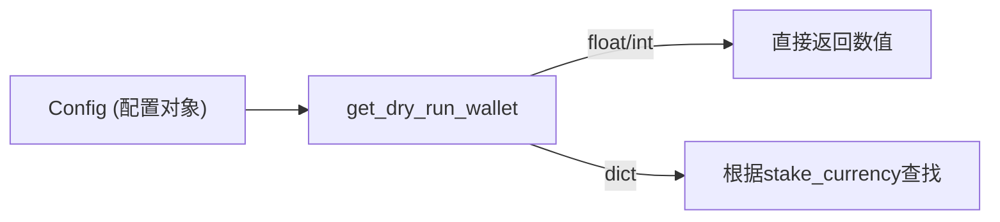

# dry_run_wallet.py

## 概述
`freqtrade/util/dry_run_wallet.py` 提供了一个简单的工具函数 `get_dry_run_wallet`，用于从配置中获取模拟运行（dry-run）模式下的钱包余额。支持两种配置方式：直接指定一个数值，或者使用字典模式为不同币种分别指定余额。

## 架构图


## 核心类/函数

### get_dry_run_wallet(config: Config) -> int | float
从配置中获取模拟运行钱包的初始余额。

**参数：**
- `config: Config` -- Freqtrade 配置字典

**返回值：**
- `int | float` -- 钱包余额

**关键逻辑：**
1. 读取 `config["dry_run_wallet"]`
2. 如果值是 `float` 或 `int` 类型，直接返回该数值
3. 如果值是字典类型，则根据 `config["stake_currency"]`（当前 stake 币种）查找对应余额，找不到则返回 `0.0`

**使用场景示例：**
```python
# 简单模式
config = {"dry_run_wallet": 1000.0, "stake_currency": "USDT"}
# 返回 1000.0

# 字典模式
config = {"dry_run_wallet": {"USDT": 1000.0, "BTC": 0.5}, "stake_currency": "BTC"}
# 返回 0.5
```

## 依赖关系

### 内部依赖（本项目模块）
- `freqtrade.constants` -- 使用 `Config` 类型定义

### 外部依赖（第三方库）
无

### 被依赖（谁引用了本文件）
- `freqtrade.util.__init__` -- 统一导出
- `freqtrade.plot.plotting` -- 绘图模块
- `freqtrade.optimize.optimize_reports.optimize_reports` -- 优化报告
- `freqtrade.optimize.hyperopt.hyperopt_optimizer` -- 超参数优化器
- `freqtrade.optimize.analysis.lookahead_helpers` -- Lookahead 分析
- `freqtrade.commands.optimize_commands` -- 优化命令
