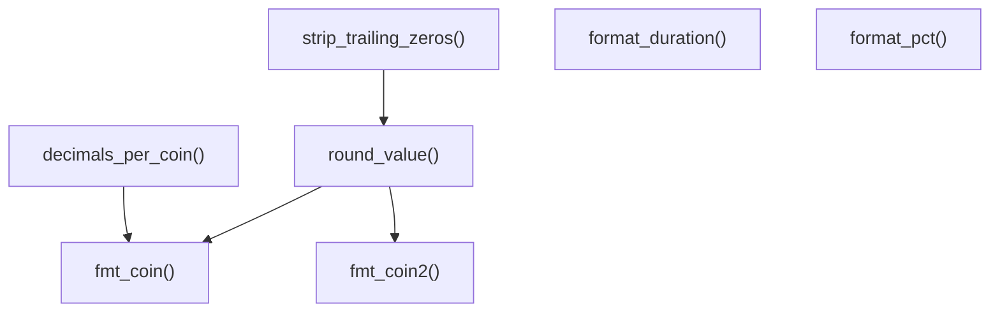

# formatters.py

## 概述
`freqtrade/util/formatters.py` 提供了一组数值格式化工具函数，主要用于将交易相关的数值（价格、收益率、时长等）格式化为人类可读的字符串。这些函数在交易报告、日志输出、Telegram 消息等场景中被广泛使用。

## 架构图

## 核心类/函数

### decimals_per_coin(coin: str) -> int
获取指定币种应显示的小数位数。

**参数：**
- `coin: str` -- 币种名称（如 "USD", "BTC"）

**返回值：**
- `int` -- 小数位数，从 `DECIMALS_PER_COIN` 字典中查找，找不到则返回 `DECIMAL_PER_COIN_FALLBACK`

### strip_trailing_zeros(value: str) -> str
去除字符串数值末尾的多余零和小数点。例如 `"222.200"` -> `"222.2"`，`"100."` -> `"100"`。

### round_value(value: float | None, decimals: int, keep_trailing_zeros=False) -> str
将浮点数四舍五入到指定小数位并转为字符串。

**参数：**
- `value: float | None` -- 要格式化的数值
- `decimals: int` -- 小数位数
- `keep_trailing_zeros: bool` -- 是否保留末尾的零

**返回值：**
- `str` -- 格式化后的字符串。`None` 或 `NaN` 返回 `"N/A"`

### fmt_coin(value: float, coin: str, show_coin_name=True, keep_trailing_zeros=False) -> str
按币种的默认精度格式化价格值。

**参数：**
- `value: float` -- 要显示的数值
- `coin: str` -- 币种名称
- `show_coin_name: bool` -- 是否附加币种名（如 `"222.22 USDT"`）
- `keep_trailing_zeros: bool` -- 是否保留末尾零

**关键逻辑：** 调用 `decimals_per_coin(coin)` 自动确定该币种的小数位数。

### fmt_coin2(value: float, coin: str, decimals: int = 8, *, show_coin_name=True, keep_trailing_zeros=False) -> str
按指定精度格式化价格值，适合用于汇率格式化。与 `fmt_coin` 的区别在于小数位数由调用者显式指定（默认 8 位），不依赖币种查找。

### format_duration(td: timedelta) -> str
将 `timedelta` 对象格式化为 `"XXd HH:MM"` 格式（如 `"3d 05:30"`）。

### format_pct(value: float | None) -> str
将浮点数格式化为百分比字符串（2 位小数），如 `0.1234` -> `"12.34%"`。`None` 或 `NaN` 返回 `"N/A"`。

## 依赖关系

### 内部依赖（本项目模块）
- `freqtrade.constants` -- 使用 `DECIMAL_PER_COIN_FALLBACK` 和 `DECIMALS_PER_COIN` 常量

### 外部依赖（第三方库）
- `numpy` -- 使用 `isnan()` 检测 NaN 值

### 被依赖（谁引用了本文件）
- `freqtrade.util.__init__` -- 统一导出
- `freqtrade.optimize.optimize_reports.*` -- 优化报告生成
- `freqtrade.optimize.hyperopt.hyperopt_output` -- 超参数优化输出
- `freqtrade.commands.optimize_commands` -- 优化命令行
