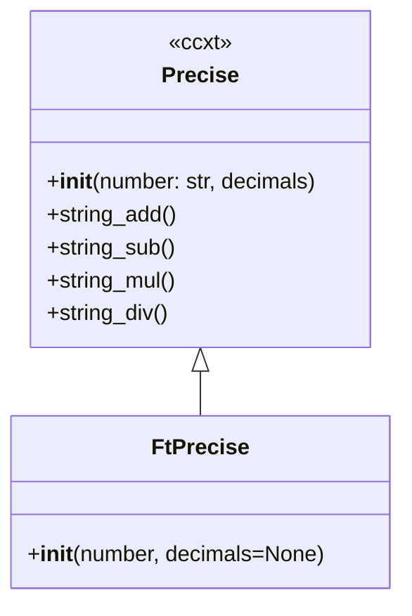

# ft_precise.py

## 概述
`freqtrade/util/ft_precise.py` 是对 ccxt 库 `Precise` 类的轻量级封装。`Precise` 类使用字符串进行高精度数学运算，避免浮点数精度问题。`FtPrecise` 的主要改进是支持浮点数（float）作为初始化参数，而原始 `Precise` 只接受字符串。

## 架构图


## 核心类/函数

### FtPrecise
继承自 `ccxt.Precise`，用于高精度数学运算。

**构造参数：**
- `number` -- 数值，可以是 `str`、`float` 或 `int`（原始 `Precise` 只支持 `str`）
- `decimals` -- 小数位数（可选）

**关键逻辑：**
- 如果 `number` 不是字符串类型，自动调用 `str()` 转换为字符串后再传给父类构造函数
- 继承了 `Precise` 的所有高精度数学运算方法

**使用场景：**
在交易中涉及资金计算时，浮点数精度问题可能导致金额错误。`FtPrecise` 通过字符串数学避免这些问题：
```python
p = FtPrecise(0.1) + FtPrecise(0.2)  # 精确结果，不会出现 0.30000000000000004
```

## 依赖关系

### 内部依赖（本项目模块）
无

### 外部依赖（第三方库）
- `ccxt` -- 使用其 `Precise` 类作为基类，提供字符串数学运算

### 被依赖（谁引用了本文件）
- `freqtrade.util.__init__` -- 统一导出
- `freqtrade.persistence.trade_model` -- 交易模型中的资金计算
- `freqtrade.optimize.backtesting` -- 回测中的资金计算
- `freqtrade.leverage.interest` -- 杠杆利息计算
- `freqtrade.freqtradebot` -- 主交易机器人中的订单计算
- `freqtrade.exchange.exchange_utils` -- 交易所工具函数中的精度处理
