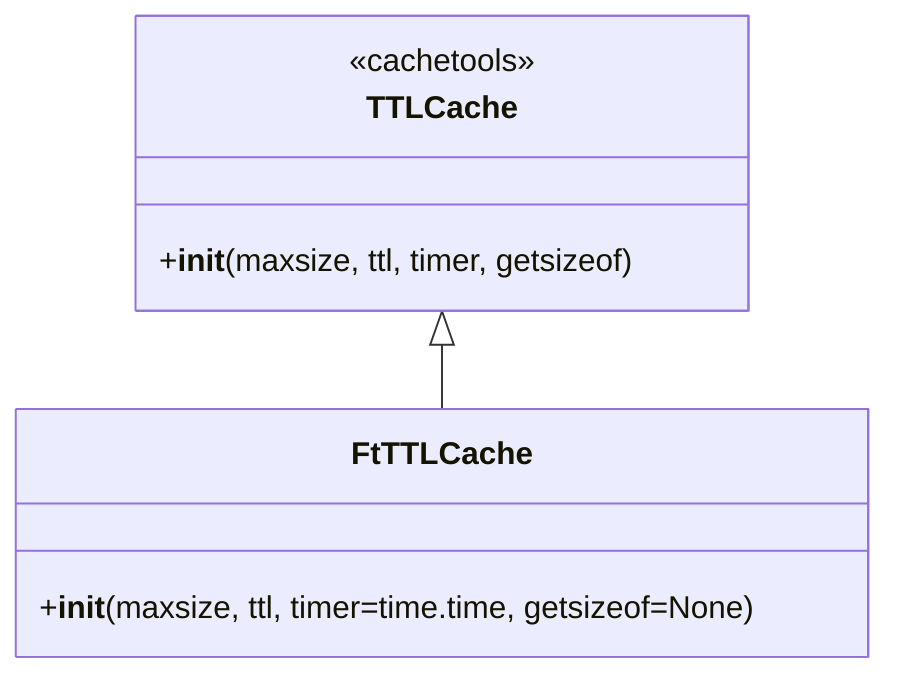

# ft_ttlcache.py

## 概述
`freqtrade/util/ft_ttlcache.py` 提供了 `FtTTLCache` 类，是 `cachetools.TTLCache` 的简单封装。主要改进是将默认 timer 显式设置为 `time.time`，使得在测试中更容易进行 mock 替换。

## 架构图

## 核心类/函数

### FtTTLCache
继承自 `cachetools.TTLCache`，带有生存时间（TTL）的缓存容器。

**构造参数：**
- `maxsize` -- 缓存的最大条目数
- `ttl` -- 每个条目的生存时间（秒）
- `timer` -- 计时器函数，默认为 `time.time`
- `getsizeof` -- 自定义大小计算函数（可选）

**关键逻辑：**
- 与 `TTLCache` 行为完全一致，唯一区别是将 `timer` 参数的默认值设为 `time.time`
- 这使得测试时可以通过 mock `time.time` 来控制缓存过期行为

## 依赖关系

### 内部依赖（本项目模块）
无

### 外部依赖（第三方库）
- `cachetools` -- 提供 `TTLCache` 基类
- `time` -- 标准库，提供 `time.time` 作为默认计时器

### 被依赖（谁引用了本文件）
- `freqtrade.util.__init__` -- 统一导出
- `freqtrade.util.measure_time` -- 用于限制回调触发频率
- `freqtrade.rpc.fiat_convert` -- 法币转换缓存
- `freqtrade.plugins.pairlist.*` -- 多个交易对筛选器使用缓存
- `freqtrade.plugins.pairlistmanager` -- 交易对列表管理器
- `freqtrade.mixins.logging_mixin` -- 日志混入类中限制重复日志
- `freqtrade.exchange.exchange` -- 交易所模块中的 API 响应缓存
- `freqtrade.exchange.binance` -- Binance 交易所特定缓存
