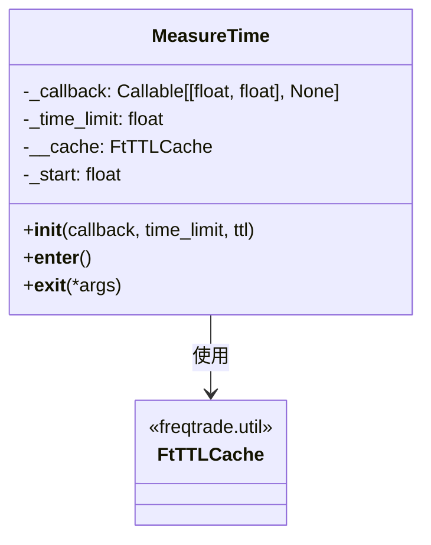

# measure_time.py

## 概述
`freqtrade/util/measure_time.py` 提供了 `MeasureTime` 上下文管理器类，用于测量代码块的执行时间。当执行时间超过设定的阈值时，会触发回调函数。内置 TTL 缓存机制，避免在短时间内重复触发回调（默认 4 小时内只触发一次）。

## 架构图


## 核心类/函数

### MeasureTime
上下文管理器，用于监控代码块执行时间。

**构造参数：**
- `callback: Callable[[float, float], None]` -- 超时回调函数，接收两个参数：实际耗时（秒）和时间限制（秒）
- `time_limit: float` -- 时间限制阈值（秒），超过此值时触发回调
- `ttl: int = 3600 * 4` -- 回调触发的冷却时间（秒），默认 4 小时。在冷却期内不会重复触发回调

**关键方法：**

#### `__enter__()`
记录开始时间 `self._start = time.time()`。

#### `__exit__(*args)`
计算执行时间，判断是否需要触发回调：
1. 检查缓存中是否已有值（表示最近已触发过回调），如果有则直接返回
2. 计算耗时 `duration = end - self._start`
3. 如果耗时小于时间限制，直接返回
4. 调用 `self._callback(duration, self._time_limit)` 触发回调
5. 将 `True` 写入缓存，使得在 TTL 期间内不再重复触发

**使用示例：**
```python
def on_slow(duration, limit):
    logger.warning(f"操作耗时 {duration:.1f}s，超过限制 {limit}s")

measure = MeasureTime(on_slow, time_limit=5.0, ttl=3600)
with measure:
    # 可能耗时的操作
    do_something()
```

## 依赖关系

### 内部依赖（本项目模块）
- `freqtrade.util.FtTTLCache` -- 用于实现回调冷却机制

### 外部依赖（第三方库）
- `time` -- 标准库，计时
- `logging` -- 标准库，日志

### 被依赖（谁引用了本文件）
- `freqtrade.util.__init__` -- 统一导出
- `freqtrade.freqtradebot` -- 主交易机器人，用于监控交易循环耗时
