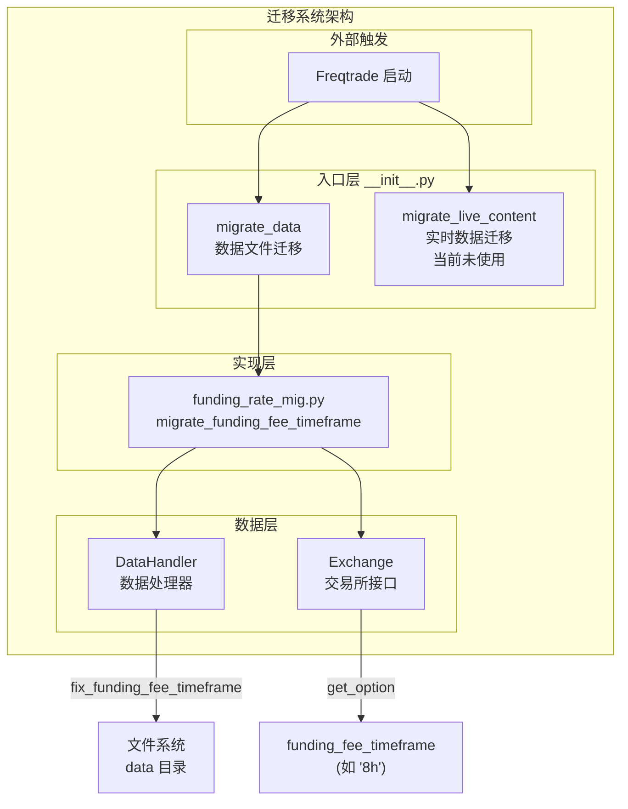
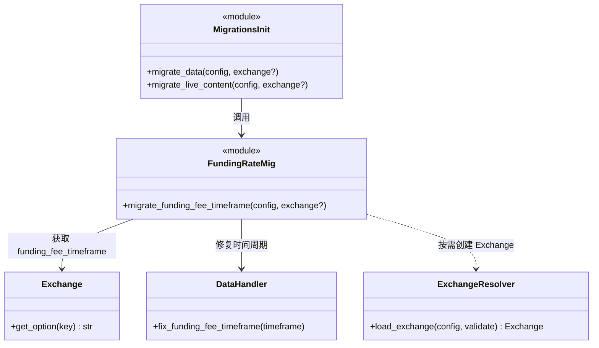
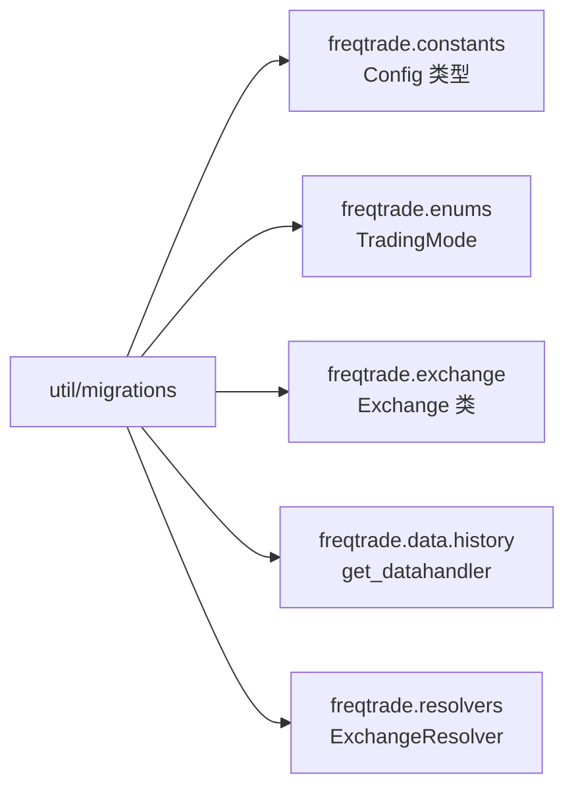
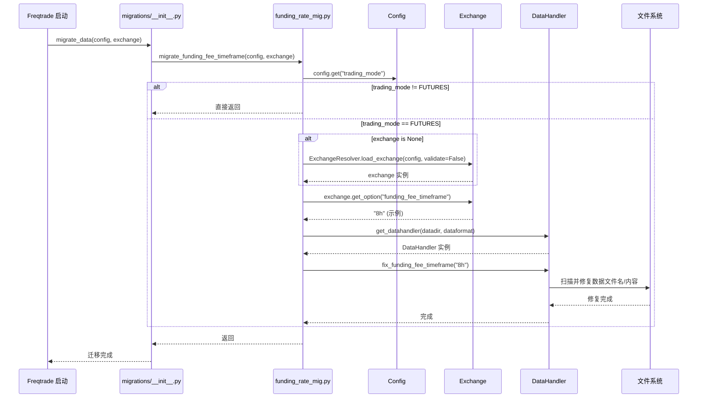
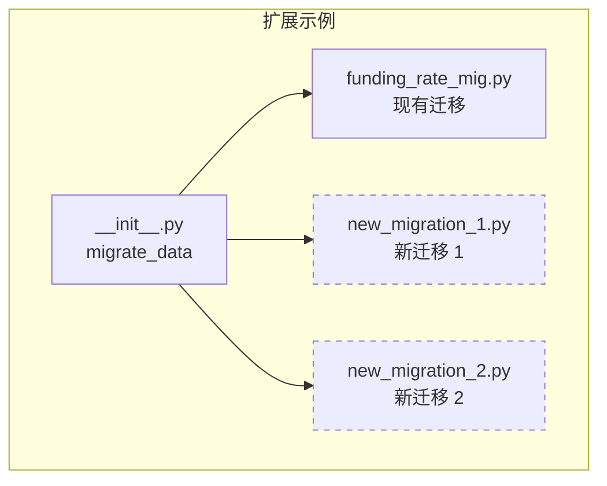

# Freqtrade Util Migrations -- 数据库迁移工具模块

## 1. 模块概述

`freqtrade/util/migrations/` 模块负责 Freqtrade 持久化数据格式的迁移与升级。当 Freqtrade 版本更新导致数据存储格式变化时，该模块自动将旧格式的数据转换为新格式，确保向后兼容性。

当前该模块主要处理以下迁移任务：
- **Funding Rate 时间周期迁移**：将 Futures 模式下的 Funding Rate 数据文件从旧的时间周期格式迁移到新格式

模块采用分层设计：
- **入口层**（`__init__.py`）：提供统一的迁移入口函数，区分数据迁移和实时内容迁移
- **实现层**（各 `*_mig.py` 文件）：每种迁移逻辑独立实现，便于扩展

## 2. 目录结构

```
freqtrade/util/migrations/
|-- __init__.py                  # 迁移入口，提供 migrate_data 和 migrate_live_content 函数
|-- funding_rate_mig.py          # Funding Rate 时间周期迁移逻辑
```

## 3. 架构图





## 4. 核心类/函数说明

### 4.1 `__init__.py` -- 迁移入口

#### `migrate_data(config, exchange=None) -> None`

数据文件迁移的统一入口函数。在 Freqtrade 启动时被调用，用于将本地持久化的数据文件从旧格式迁移到新格式。

**参数：**
- `config`：Freqtrade 配置字典
- `exchange`：Exchange 实例（可选）。如果未传入，迁移函数内部会按需创建

**当前调用的迁移：**
- `migrate_funding_fee_timeframe(config, exchange)` -- Funding Rate 数据文件的时间周期迁移

#### `migrate_live_content(config, exchange=None) -> None`

实时数据（数据库内容）迁移的入口函数，用于 Dry-run 和 Live 模式。当前该函数为空实现（`pass`），预留为未来的数据库内容迁移使用。

**设计意图：**
- `migrate_data` 处理文件系统中的数据文件（如 OHLCV 数据、Funding Rate 数据）
- `migrate_live_content` 处理 SQLite/PostgreSQL 数据库中的交易记录等内容

### 4.2 `funding_rate_mig.py` -- Funding Rate 时间周期迁移

#### `migrate_funding_fee_timeframe(config, exchange) -> None`

将 Funding Rate 数据文件从旧的时间周期格式迁移到正确的时间周期格式。

**背景说明：**

在 Futures（永续合约）交易中，Funding Rate（资金费率）的结算周期因交易所而异。例如：
- Binance 通常使用 8 小时周期
- 某些交易所可能使用 4 小时或 1 小时周期

早期版本的 Freqtrade 可能以错误的时间周期存储了 Funding Rate 数据文件。此迁移函数负责修复这些文件的时间周期标记。

**执行流程：**

```
1. 检查交易模式是否为 FUTURES
   |-- 非 FUTURES -> 直接返回（不需要迁移）
   |-- FUTURES -> 继续

2. 获取 Exchange 实例
   |-- 已传入 -> 直接使用
   |-- 未传入 -> 通过 ExchangeResolver.load_exchange() 创建（validate=False，不做完整验证）

3. 获取正确的 funding_fee_timeframe
   |-- exchange.get_option("funding_fee_timeframe") -> 如 "8h"

4. 获取 DataHandler
   |-- get_datahandler(config["datadir"], config["dataformat_ohlcv"])

5. 执行修复
   |-- dhc.fix_funding_fee_timeframe(ff_timeframe)
```

**条件判断：**
- 只有当 `trading_mode` 为 `TradingMode.FUTURES` 时才执行迁移
- 默认 `trading_mode` 为 `TradingMode.SPOT`，因此在现货模式下此函数为 no-op

**Exchange 懒加载：**

如果调用方没有传入 `exchange` 参数，函数会通过 `ExchangeResolver.load_exchange()` 创建一个新的 Exchange 实例。此处使用 `validate=False` 参数，跳过完整的配置验证，仅创建最小化的 Exchange 对象以获取交易所选项。

## 5. 依赖关系

### 内部依赖



**详细依赖说明：**

| 依赖模块 | 使用位置 | 用途 |
|---------|---------|------|
| `freqtrade.constants.Config` | `__init__.py`, `funding_rate_mig.py` | 配置字典类型标注 |
| `freqtrade.enums.TradingMode` | `funding_rate_mig.py` | 判断交易模式（SPOT/FUTURES） |
| `freqtrade.exchange.Exchange` | `__init__.py`, `funding_rate_mig.py` | 获取交易所选项信息 |
| `freqtrade.data.history.get_datahandler` | `funding_rate_mig.py` | 获取数据处理器实例 |
| `freqtrade.resolvers.ExchangeResolver` | `funding_rate_mig.py` | 按需创建 Exchange 实例（延迟导入） |

### 外部依赖

该模块不直接依赖外部第三方库，所有外部交互通过内部模块间接完成。

### 被依赖关系

```
freqtrade 启动流程
    |
    v
freqtrade.freqtradebot.FreqtradeBot.__init__()
    |
    v
freqtrade.util.migrations.migrate_data(config, exchange)
```

该模块在 Freqtrade 主业务逻辑启动前被调用，确保数据文件格式正确。

## 6. 数据流

### Funding Rate 迁移数据流



### 迁移系统的扩展模式

当需要添加新的迁移逻辑时，遵循以下模式：

```
1. 创建新的迁移文件：freqtrade/util/migrations/new_migration.py
   - 实现具体的迁移函数

2. 在 __init__.py 中注册：
   - 导入新的迁移函数
   - 在 migrate_data() 或 migrate_live_content() 中调用
```



### 文件系统中的数据文件结构

```
user_data/data/<exchange>/
|-- futures/
|   |-- BTC_USDT-8h-funding_rate.feather    # 修复后的文件名
|   |-- ETH_USDT-8h-funding_rate.feather
|   |-- ...
```

迁移函数 `fix_funding_fee_timeframe` 的作用是确保这些数据文件的时间周期标记（如文件名中的 `8h`）与交易所实际的 Funding Rate 结算周期一致。

### 安全性设计

- **幂等性**：迁移函数设计为可重复执行。如果数据文件已经是正确格式，再次执行不会造成问题
- **模式检查**：只在 FUTURES 模式下执行，避免对 SPOT 模式的数据造成影响
- **最小权限**：Exchange 实例以 `validate=False` 创建，不需要完整的 API 密钥验证
- **错误隔离**：迁移失败不应阻止 Freqtrade 的正常启动（具体错误处理由 DataHandler 实现）
