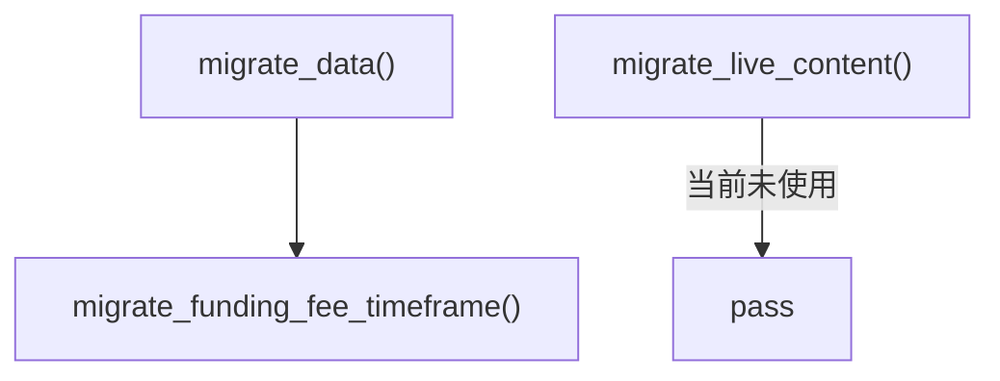

# __init__.py (migrations)

## 概述
`freqtrade/util/migrations/__init__.py` 是数据迁移子包的入口文件，提供了两个顶层迁移函数，用于在 Freqtrade 升级时将旧格式的数据迁移到新格式。目前主要涉及 funding rate（资金费率）相关数据的时间周期迁移。

## 架构图

## 核心类/函数

### migrate_data(config, exchange: Exchange | None = None) -> None
执行数据格式迁移。这是数据迁移的主入口函数。

**参数：**
- `config` -- Freqtrade 配置对象
- `exchange: Exchange | None` -- 交易所实例（可选）。如果为 `None`，迁移函数内部会自行创建

**关键逻辑：**
调用 `migrate_funding_fee_timeframe(config, exchange)` 来处理资金费率的时间周期迁移。

### migrate_live_content(config, exchange: Exchange | None = None) -> None
迁移数据库中的内容（从旧格式到新格式），用于 dry-run/live 模式。

**参数：**
- `config` -- Freqtrade 配置对象
- `exchange: Exchange | None` -- 交易所实例（可选）

**当前状态：** 目前此函数体为空（`pass`），预留给未来使用。

## 依赖关系

### 内部依赖（本项目模块）
- `freqtrade.exchange.Exchange` -- 交易所基类
- `freqtrade.util.migrations.funding_rate_mig` -- 资金费率迁移模块

### 外部依赖（第三方库）
无

### 被依赖（谁引用了本文件）
- `freqtrade.optimize.backtesting` -- 回测开始前执行数据迁移
- `freqtrade.freqtradebot` -- 主交易机器人启动时执行数据迁移
- `freqtrade.data.history.history_utils` -- 历史数据处理时执行迁移
- `freqtrade.commands.data_commands` -- 数据命令行中触发迁移
