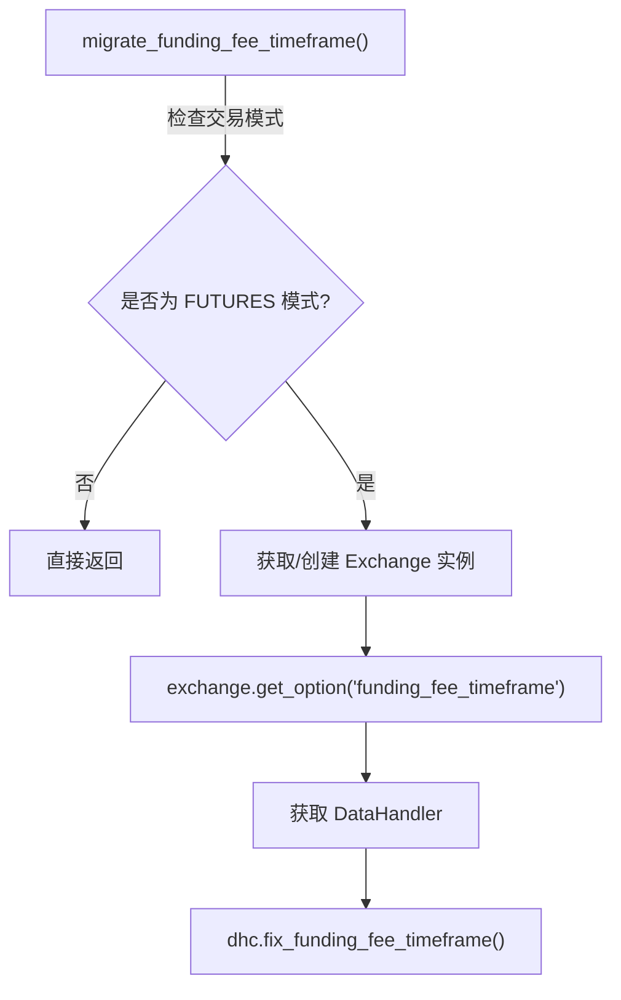

# funding_rate_mig.py

## 概述
`freqtrade/util/migrations/funding_rate_mig.py` 实现了 funding fee（资金费）数据文件的时间周期迁移功能。当交易所的资金费率结算时间周期发生变化时，此模块负责修复本地已保存的历史数据文件的时间周期设置，确保数据一致性。仅在期货（Futures）交易模式下生效。

## 架构图

## 核心类/函数

### migrate_funding_fee_timeframe(config: Config, exchange: Exchange | None)
修复本地 funding fee 数据文件的时间周期。

**参数：**
- `config: Config` -- Freqtrade 配置对象
- `exchange: Exchange | None` -- 交易所实例。如果为 `None`，函数内部会通过 `ExchangeResolver` 动态创建（`validate=False` 跳过验证以加快速度）

**关键逻辑：**
1. 检查配置中的 `trading_mode` 是否为 `TradingMode.FUTURES`，如果不是则直接返回（仅期货模式需要此迁移）
2. 如果未提供 `exchange` 实例，通过 `ExchangeResolver.load_exchange()` 延迟加载一个交易所实例
3. 从交易所实例获取 `funding_fee_timeframe` 选项值（不同交易所可能有不同的资金费率结算周期，如 8 小时、4 小时等）
4. 获取数据处理器（DataHandler）实例
5. 调用 `dhc.fix_funding_fee_timeframe(ff_timeframe)` 修复本地数据文件中的时间周期设置

## 依赖关系

### 内部依赖（本项目模块）
- `freqtrade.constants.Config` -- 配置类型定义
- `freqtrade.enums.TradingMode` -- 交易模式枚举
- `freqtrade.exchange.Exchange` -- 交易所基类
- `freqtrade.data.history.get_datahandler` -- 获取数据处理器（延迟导入）
- `freqtrade.resolvers.ExchangeResolver` -- 交易所解析器（延迟导入，仅在需要时加载）

### 外部依赖（第三方库）
- `logging` -- 标准库，日志记录

### 被依赖（谁引用了本文件）
- `freqtrade.util.migrations.__init__` -- 被 `migrate_data()` 调用
