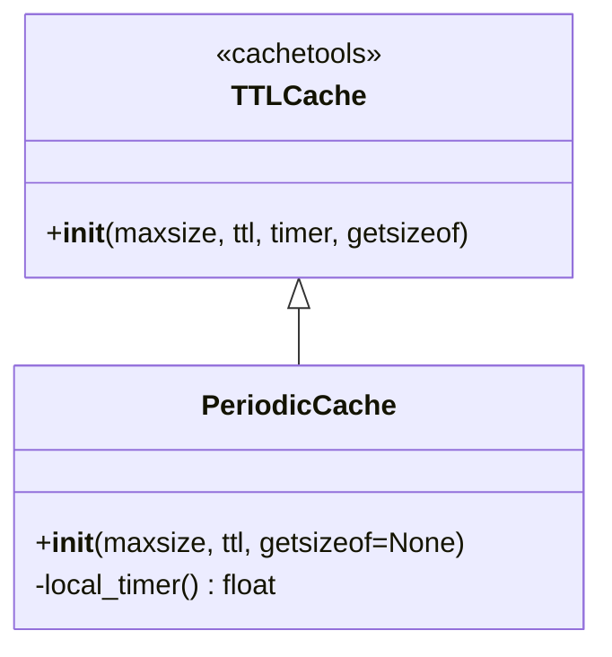

# periodic_cache.py

## 概述
`freqtrade/util/periodic_cache.py` 提供了 `PeriodicCache` 类，是 `cachetools.TTLCache` 的特殊子类。与普通 TTL 缓存不同的是，它会在"整点"时刻过期——例如，TTL 为 3600 秒（1 小时）的缓存，会在每个整点（:00）时统一过期，而非从写入时刻开始计时。

## 架构图


## 核心类/函数

### PeriodicCache
在"整齐"时间点过期的缓存。

**构造参数：**
- `maxsize` -- 缓存最大条目数
- `ttl` -- 过期周期（秒），例如 3600 表示每小时过期一次
- `getsizeof` -- 自定义大小计算函数（可选）

**关键逻辑：**

在构造时定义了一个内部 `local_timer()` 函数作为自定义计时器：
```python
def local_timer():
    ts = datetime.now(UTC).timestamp()
    offset = ts % ttl
    return ts - offset
```

工作原理：
1. 获取当前 UTC 时间戳 `ts`
2. 计算 `ts` 对 `ttl` 取模得到的偏移量 `offset`
3. 返回 `ts - offset`，即向下对齐到最近的周期起始点

例如：如果 TTL = 3600（1 小时），当前时间是 14:35:22，则 `local_timer()` 返回的是 14:00:00 对应的时间戳。这样在同一个小时内，所有 timer 值相同，一旦跨入下一个小时（15:00:00），timer 值发生变化，所有缓存条目即过期。

父类初始化时 TTL 传入 `ttl - 1e-5`（减去极小值），是为了避免因浮点精度导致的边界问题。

## 依赖关系

### 内部依赖（本项目模块）
无

### 外部依赖（第三方库）
- `cachetools` -- 提供 `TTLCache` 基类
- `datetime` -- 标准库，用于获取 UTC 时间戳

### 被依赖（谁引用了本文件）
- `freqtrade.util.__init__` -- 统一导出
- `freqtrade.plugins.pairlist.ShuffleFilter` -- 交易对随机排序过滤器
- `freqtrade.plugins.pairlist.AgeFilter` -- 交易对年龄过滤器
- `freqtrade.freqtradebot` -- 主交易机器人
- `freqtrade.exchange.exchange` -- 交易所模块
- `freqtrade.data.dataprovider` -- 数据提供者
