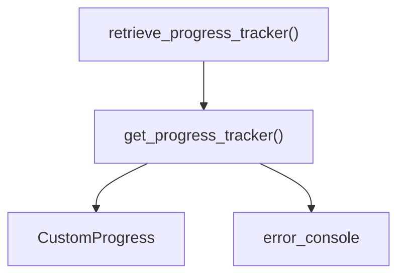

# progress_tracker.py

## 概述
`freqtrade/util/progress_tracker.py` 提供了进度跟踪器的创建和获取功能。基于 Rich 库的 Progress 组件，定义了包含描述文本、进度条、完成数量、百分比、已用时间、剩余时间等列的进度条模板，用于在 Freqtrade 的各种耗时操作（如数据下载、回测等）中显示进度。

## 架构图

## 核心类/函数

### retrieve_progress_tracker(pt: CustomProgress | None) -> CustomProgress
获取进度跟踪器实例。如果传入的 `pt` 不为 `None`，直接返回该实例；否则调用 `get_progress_tracker()` 创建新实例。用于在可选传入进度跟踪器的场景中确保总有一个可用的实例。

**参数：**
- `pt: CustomProgress | None` -- 可选的进度跟踪器实例

**返回值：**
- `CustomProgress` -- 进度跟踪器实例

### get_progress_tracker(**kwargs) -> CustomProgress
创建并返回一个带有预定义列的 `CustomProgress` 进度条实例。

**进度条列配置：**
1. `TextColumn` -- 显示任务描述
2. `BarColumn` -- 进度条（自适应宽度）
3. `MofNCompleteColumn` -- M/N 完成数显示
4. `TaskProgressColumn` -- 百分比进度
5. `"*"` 分隔符
6. `TimeElapsedColumn` -- 已用时间
7. `"*"` 分隔符
8. `TimeRemainingColumn` -- 剩余时间

**其他设置：**
- `expand=True` -- 进度条扩展至整行
- `console=error_console` -- 输出到 error console（来自 `freqtrade.loggers`），避免与正常日志混淆

## 依赖关系

### 内部依赖（本项目模块）
- `freqtrade.util.rich_progress` -- 使用 `CustomProgress` 类
- `freqtrade.loggers` -- 使用 `error_console`（延迟导入）

### 外部依赖（第三方库）
- `rich.progress` -- Rich 进度条组件（BarColumn, MofNCompleteColumn, TaskProgressColumn 等）

### 被依赖（谁引用了本文件）
- `freqtrade.util.__init__` -- 统一导出
- `freqtrade.rpc.api_server.api_download_data` -- API 数据下载
- `freqtrade.optimize.hyperopt.hyperopt` -- 超参数优化
- `freqtrade.data.history.history_utils` -- 历史数据工具
