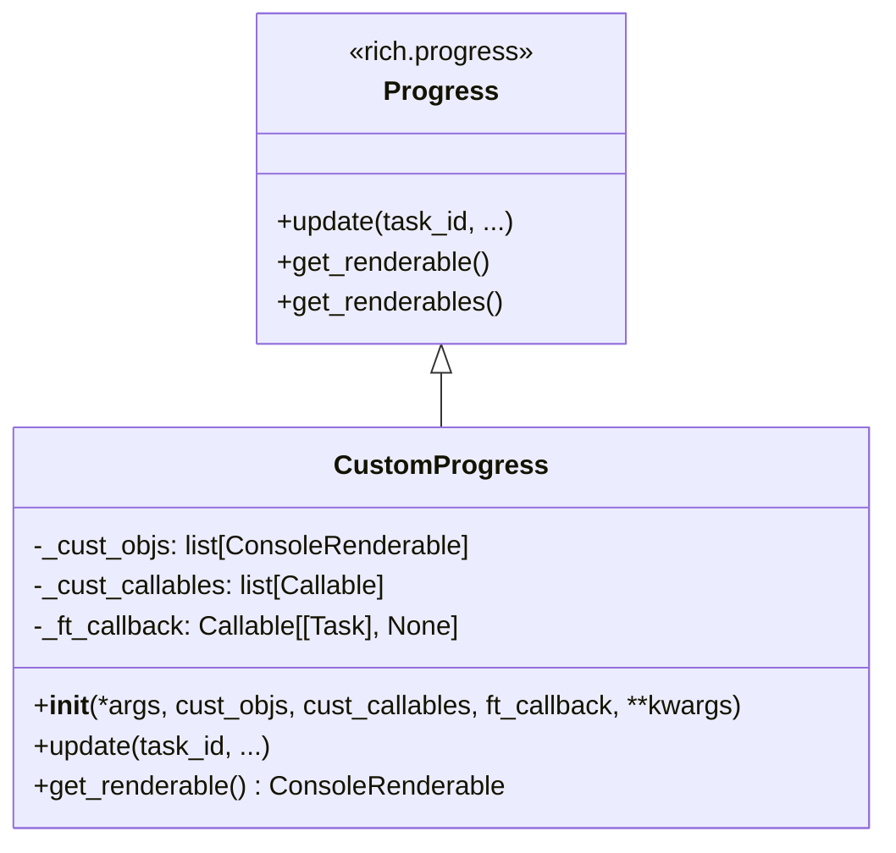

# rich_progress.py

## 概述
`freqtrade/util/rich_progress.py` 提供了 `CustomProgress` 类，是 Rich 库 `Progress` 的扩展子类。增加了自定义渲染对象（如额外的 Rich 可渲染组件）和回调机制（用于将进度信息传递给外部系统，如 API 接口），使进度条功能更灵活。

## 架构图

## 核心类/函数

### CustomProgress
扩展的 Rich Progress 类，支持自定义渲染对象和进度回调。

**构造参数：**
- `*args` -- 传给 `Progress` 的位置参数（通常是各种 Column）
- `cust_objs: list[ConsoleRenderable] | None` -- 自定义的静态渲染对象列表，会被追加到进度条上方显示
- `cust_callables: list[Callable[[], ConsoleRenderable]] | None` -- 自定义的可调用对象列表，每次渲染时调用以获取动态内容
- `ft_callback: Callable[[Task], None] | None` -- 进度更新回调函数。当设置了此回调时，会自动禁用 Rich 的终端显示（`disable=True`），因为进度信息将通过回调传递而非终端显示
- `**kwargs` -- 传给 `Progress` 的其他关键字参数

**关键方法：**

#### update(task_id, *, total, completed, advance, description, visible, refresh, **fields)
重写 `Progress.update()`，在原始更新逻辑执行后，如果设置了 `_ft_callback`，会将当前任务对象传递给回调函数。

#### get_renderable() -> ConsoleRenderable
重写 `Progress.get_renderable()`，将自定义渲染对象（`_cust_objs` 中的静态对象 + `_cust_callables` 中动态生成的对象）与标准进度条渲染内容组合为一个 `Group`。

## 依赖关系

### 内部依赖（本项目模块）
无

### 外部依赖（第三方库）
- `rich.progress` -- 提供 `Progress`, `Task`, `TaskID` 基类
- `rich.console` -- 提供 `ConsoleRenderable`, `Group`, `RichCast` 类型

### 被依赖（谁引用了本文件）
- `freqtrade.util.__init__` -- 统一导出
- `freqtrade.util.progress_tracker` -- 使用 `CustomProgress` 创建进度跟踪器
