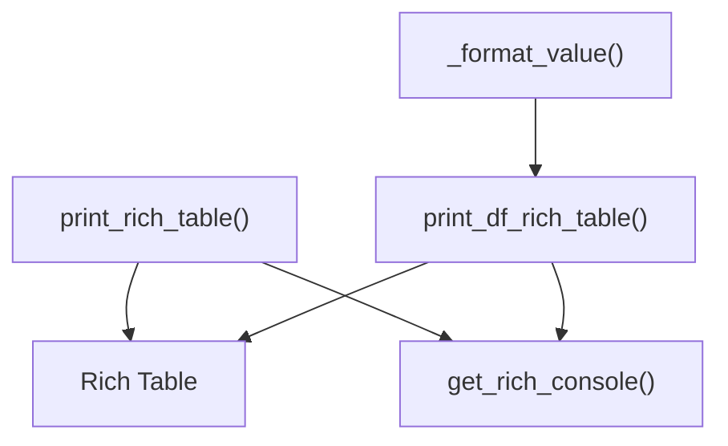

# rich_tables.py

## 概述
`freqtrade/util/rich_tables.py` 提供了两个基于 Rich 库的表格打印函数，用于在终端中以美观的表格形式输出数据。支持字典序列和 Pandas DataFrame 两种数据源。是 Freqtrade 命令行输出的核心显示模块。

## 架构图

## 核心类/函数

### TextOrString (TypeAlias)
类型别名：`str | Text`，表示可以是普通字符串或 Rich `Text` 对象。

### print_rich_table(tabular_data, headers, summary=None, *, justify="right", table_kwargs=None) -> None
将字典序列或字符串序列打印为 Rich 表格。

**参数：**
- `tabular_data: Sequence[dict[str, Any] | Sequence[TextOrString]]` -- 表格数据，每一行可以是字典或字符串序列
- `headers: Sequence[str]` -- 列标题
- `summary: str | None` -- 表格标题（可选）
- `justify: str` -- 列对齐方式，默认 `"right"`
- `table_kwargs: dict[str, Any] | None` -- 传给 `Table` 构造函数的额外参数

**关键逻辑：**
1. 为每个列头创建 `Column` 对象（支持直接传入 `Column` 实例或字符串）
2. 遍历数据行：
   - 如果行是字典，按 headers 顺序提取值
   - 如果行是序列，直接使用
3. 自动将非 `Text` 类型转为字符串
4. 通过 `get_rich_console()` 获取控制台并打印

### _format_value(value: Any, *, floatfmt: str) -> str
内部辅助函数，将值格式化为字符串。浮点数使用指定的格式字符串格式化，其他类型直接 `str()` 转换。

### print_df_rich_table(tabular_data, headers, summary=None, *, show_index=False, index_name=None, table_kwargs=None) -> None
将 Pandas DataFrame 打印为 Rich 表格。

**参数：**
- `tabular_data: DataFrame` -- Pandas DataFrame 数据
- `headers: Sequence[str]` -- 列标题
- `summary: str | None` -- 表格标题（可选）
- `show_index: bool` -- 是否显示索引列，默认 `False`
- `index_name: str | None` -- 索引列的标题名
- `table_kwargs: dict[str, Any] | None` -- 传给 `Table` 的额外参数

**关键逻辑：**
1. 如果 `show_index=True`，添加索引列
2. 使用 `itertuples()` 遍历 DataFrame 行
3. 浮点数默认使用 `".3f"` 格式（3 位小数）

## 依赖关系

### 内部依赖（本项目模块）
- `freqtrade.loggers.rich_console` -- 使用 `get_rich_console()` 获取 Rich 控制台实例

### 外部依赖（第三方库）
- `rich.table` -- 提供 `Table` 和 `Column` 类
- `rich.text` -- 提供 `Text` 类
- `pandas` -- 提供 `DataFrame` 支持

### 被依赖（谁引用了本文件）
- `freqtrade.util.__init__` -- 统一导出
- `freqtrade.optimize.optimize_reports.bt_output` -- 回测报告输出
- `freqtrade.optimize.analysis.lookahead_helpers` -- Lookahead 分析输出
- `freqtrade.optimize.analysis.recursive_helpers` -- 递归分析输出
- `freqtrade.data.entryexitanalysis` -- 入场/出场分析
- `freqtrade.commands.data_commands` -- 数据命令行输出
- `freqtrade.commands.list_commands` -- 列表命令行输出
