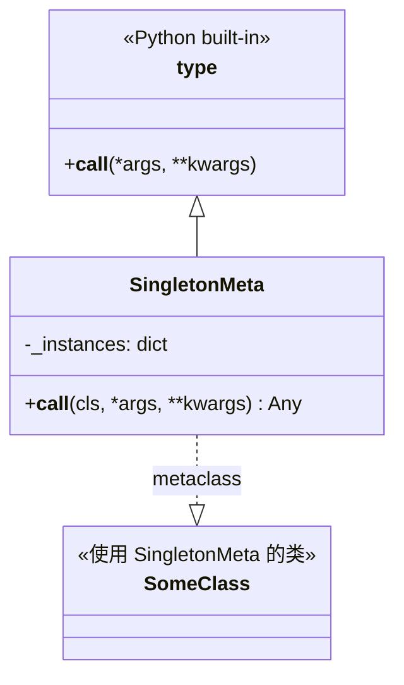

# singleton.py

## 概述
`freqtrade/util/singleton.py` 提供了 `SingletonMeta` 元类（metaclass），用于实现单例设计模式。通过将此元类应用于类定义，可以确保该类在整个程序生命周期中只会创建一个实例。

## 架构图


## 核心类/函数

### SingletonMeta
单例模式的元类实现。

**类属性：**
- `_instances: dict` -- 类级别字典，存储各个使用该元类的类的唯一实例

**方法：**

#### `__call__(cls, *args, **kwargs) -> Any`
拦截类的实例化过程：
1. 检查 `_instances` 字典中是否已存在 `cls` 对应的实例
2. 如果不存在，调用 `super().__call__()` 创建新实例并存入 `_instances`
3. 返回已存在的实例（无论传入什么参数，后续调用都返回同一实例）

**使用示例：**
```python
class MyClass(metaclass=SingletonMeta):
    def __init__(self, value):
        self.value = value

a = MyClass(1)
b = MyClass(2)
assert a is b  # True，b 是同一个实例
assert a.value == 1  # 值不会被第二次初始化覆盖
```

**注意事项：**
- 该实现不是线程安全的（尽管文档说明中声称是线程安全的）。在多线程环境下，两个线程可能同时通过 `cls not in cls._instances` 检查并各自创建实例。
- 在 Freqtrade 的实际使用中，这通常不是问题，因为单例初始化发生在程序启动阶段。

## 依赖关系

### 内部依赖（本项目模块）
无

### 外部依赖（第三方库）
无（仅使用 Python 标准库 `typing.Any`）

### 被依赖（谁引用了本文件）
- `freqtrade.rpc.fiat_convert` -- `CryptoToFiatConverter` 使用单例模式
