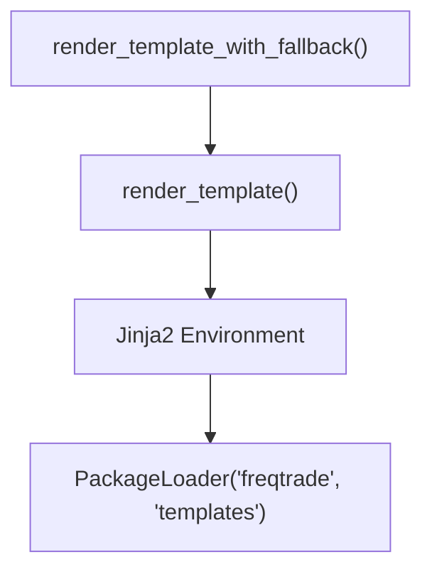

# template_renderer.py

## 概述
`freqtrade/util/template_renderer.py` 提供了基于 Jinja2 模板引擎的渲染工具函数，用于动态生成策略文件、配置文件等文本内容。Freqtrade 在用户通过命令行创建新策略或配置时，使用这些函数将模板中的占位符替换为实际内容。

## 架构图

## 核心类/函数

### render_template(templatefile: str, arguments: dict) -> str
渲染指定的 Jinja2 模板文件。

**参数：**
- `templatefile: str` -- 模板文件名（相对于 `freqtrade/templates/` 目录）
- `arguments: dict` -- 传递给模板的变量字典

**返回值：**
- `str` -- 渲染后的文本内容

**关键逻辑：**
1. 使用 `PackageLoader("freqtrade", "templates")` 从 `freqtrade/templates/` 目录加载模板
2. 启用 HTML/XML 自动转义（`select_autoescape(["html", "xml"])`)
3. 获取并渲染模板，将 `arguments` 字典中的变量传入

### render_template_with_fallback(templatefile: str, templatefallbackfile: str, arguments: dict | None = None) -> str
带回退机制的模板渲染。

**参数：**
- `templatefile: str` -- 优先使用的模板文件名
- `templatefallbackfile: str` -- 回退模板文件名
- `arguments: dict | None` -- 模板变量字典，默认为空字典

**返回值：**
- `str` -- 渲染后的文本内容

**关键逻辑：**
1. 尝试使用 `templatefile` 渲染
2. 如果 `templatefile` 不存在（抛出 `TemplateNotFound` 异常），则使用 `templatefallbackfile` 作为回退
3. 这种设计允许用户自定义模板，同时保留默认模板作为兜底

## 依赖关系

### 内部依赖（本项目模块）
无

### 外部依赖（第三方库）
- `jinja2` -- 模板引擎，提供 `Environment`, `PackageLoader`, `select_autoescape`
- `jinja2.exceptions` -- 提供 `TemplateNotFound` 异常类（延迟导入）

### 被依赖（谁引用了本文件）
- `freqtrade.util.__init__` -- 统一导出
- `freqtrade.configuration.deploy_config` -- 部署配置文件生成
- `freqtrade.commands.deploy_commands` -- 部署命令（创建新策略等）
