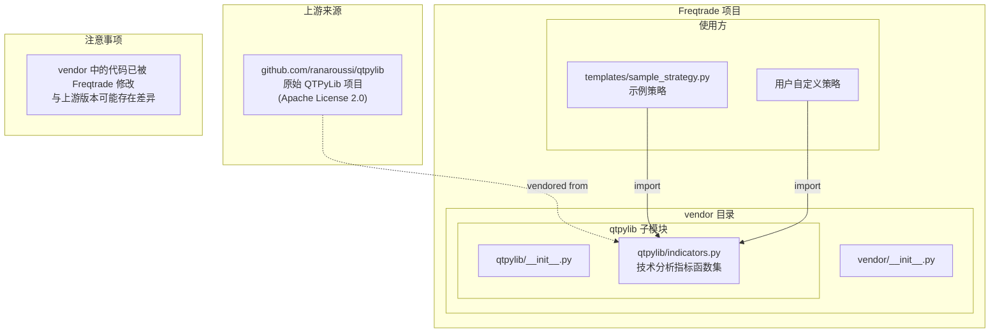
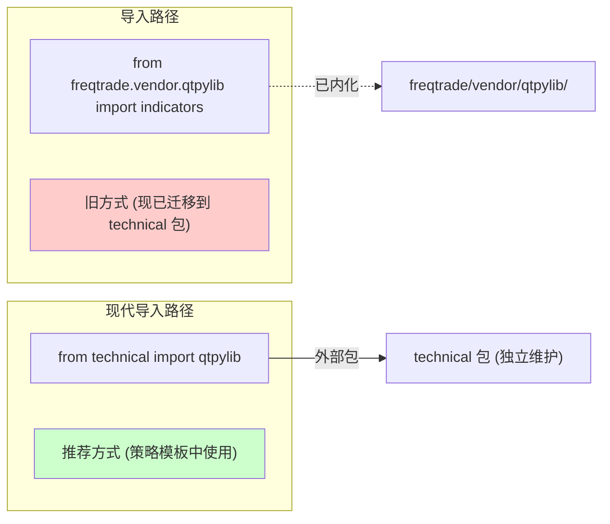
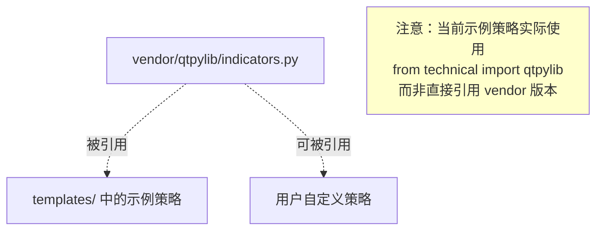
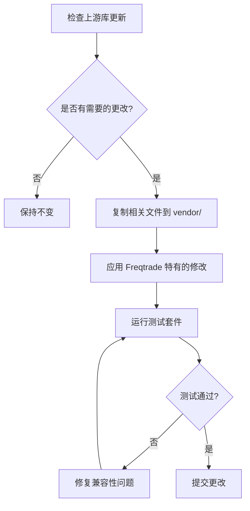

# Freqtrade Vendor -- 第三方库目录

## 1. 模块概述

`freqtrade/vendor/` 目录是 Freqtrade 项目中用于存放第三方库代码的 vendor 目录。该目录采用"vendor"模式（也称为"vendoring"），即将第三方库的源码直接复制到项目中，而非通过包管理器（pip）安装。

采用 vendor 模式的原因：
- **版本控制**：确保使用的第三方库版本与 Freqtrade 完全兼容，避免上游库版本升级导致的不兼容问题
- **修改定制**：可以对第三方库进行针对性修改，适配 Freqtrade 的特定需求（如禁用有 lookahead bias 风险的 `vwap` 函数）
- **减少依赖**：不需要安装完整的第三方库包，只引入实际使用的部分代码
- **稳定性保障**：当第三方库不再维护或从 PyPI 下架时，仍然可以正常使用

当前 vendor 目录中包含的第三方库：
- **qtpylib** -- 来自 [QTPyLib](https://github.com/ranaroussi/qtpylib) 项目的技术分析指标库

## 2. 目录结构

```
freqtrade/vendor/
|-- __init__.py                  # 空初始化文件（使目录成为 Python 包）
|-- qtpylib/                     # QTPyLib 技术分析指标库（详见单独文档）
    |-- __init__.py              # 空初始化文件
    |-- indicators.py            # 技术分析指标函数集合
```

## 3. 架构图





## 4. 核心内容说明

### 4.1 Vendor 模式与外部包的关系

Freqtrade 生态中有两个 qtpylib 的来源：

| 来源 | 路径 | 说明 |
|------|------|------|
| vendor 内置 | `freqtrade.vendor.qtpylib.indicators` | 项目内置的 vendored 版本，由 Freqtrade 团队维护 |
| technical 包 | `technical.qtpylib` | 独立的 `technical` Python 包中的版本 |

在示例策略和模板中，当前推荐使用 `from technical import qtpylib` 的方式，即使用 `technical` 外部包。vendor 目录中的版本作为内部备用和历史保留。

### 4.2 `__init__.py` 文件

vendor 目录和 qtpylib 子目录的 `__init__.py` 文件均为空文件，其作用仅是将目录标记为 Python 包，使得 Python 的 import 机制能够正确识别模块路径。

### 4.3 许可证

vendor 目录中的代码保留了原始项目的许可证声明：

- **QTPyLib**：Apache License 2.0
  - 版权所有：2016-2018 Ran Aroussi
  - 项目地址：https://github.com/ranaroussi/qtpylib

在 vendor 代码文件的头部保留了完整的许可证注释，符合 Apache 2.0 许可证的再分发要求。

## 5. 依赖关系

### 内部依赖

vendor 目录中的代码尽量减少对 Freqtrade 其他模块的依赖：

```
freqtrade/vendor/qtpylib/indicators.py
|-- numpy           # 数值计算
|-- pandas          # 数据处理（DataFrame, Series）
|-- datetime        # 日期时间处理（仅 session 函数使用）
```

vendor 中的代码不依赖 Freqtrade 的任何其他模块，保持了良好的独立性。

### 外部依赖

| 库 | 用途 |
|----|------|
| `numpy` | 数组运算、rolling window 计算、NaN 处理 |
| `pandas` | Series/DataFrame 操作、rolling 窗口函数、PandasObject 扩展 |

### 被依赖关系



## 6. Vendor 管理策略

### 何时更新 vendor 代码

- 上游库修复了关键 bug
- 需要新增上游库的某个功能
- 安全漏洞修复

### 更新流程



### Freqtrade 对 vendor 代码的修改

与原始 QTPyLib 相比，Freqtrade vendor 版本的主要修改包括：

1. **禁用 `vwap` 函数**：将 `vwap()` 函数改为直接抛出 `ValueError`，提示用户使用 `rolling_vwap` 代替，因为原始的 `vwap` 使用了全量数据的累积计算，会导致 lookahead bias（前瞻偏差），在回测中产生不真实的结果

2. **代码风格调整**：按照 Freqtrade 的代码规范进行了格式化调整（如 f-string 使用、类型注解等）

3. **保留核心功能**：只保留了 `indicators.py` 中的技术指标函数，去掉了原始 QTPyLib 中的交易执行、数据获取等不相关的模块

## 7. QTPyLib 指标概览

vendor 中的 `qtpylib/indicators.py` 提供了以下技术分析指标（完整文档请参见 `docs/yuanlin/vendor/qtpylib/README.md`）：

### 7.1 移动平均线族

| 指标 | 函数名 | 说明 |
|------|--------|------|
| 简单移动平均 | `sma(series, window)` | 基于算术平均的滚动均值 |
| 加权移动平均 | `wma(series, window)` | 指数加权移动平均（EWM） |
| Hull 移动平均 | `hma(series, window)` | 低延迟均线，使用 WMA 的差分构造 |
| 零延迟均线 | `zlma(series, window, kind)` | John Ehlers 零延迟移动平均 |
| 零延迟 EMA | `zlema(series, window)` | zlma 的 EMA 变体 |
| 零延迟 SMA | `zlsma(series, window)` | zlma 的 SMA 变体 |
| 零延迟 HMA | `zlhma(series, window)` | zlma 的 HMA 变体 |

### 7.2 布林带和通道

| 指标 | 函数名 | 返回值 |
|------|--------|--------|
| 标准布林带 | `bollinger_bands(series, window, stds)` | DataFrame: upper, mid, lower |
| 加权布林带 | `weighted_bollinger_bands(series, window, stds)` | DataFrame: upper, mid, lower (EMA 中轨) |
| Keltner 通道 | `keltner_channel(bars, window, atrs)` | DataFrame: upper, mid, lower (ATR 基准) |

### 7.3 动量和趋势指标

| 指标 | 函数名 | 说明 |
|------|--------|------|
| RSI | `rsi(series, window)` | 相对强弱指标，Wilder 平滑法 |
| MACD | `macd(series, fast, slow, smooth)` | 移动平均收敛/发散 |
| Stochastic | `stoch(df, window, d, k, fast)` | 随机指标（快速/慢速） |
| CCI | `cci(series, window)` | 商品通道指标 |
| ROC | `roc(series, window)` | 变化率 |
| AO | `awesome_oscillator(df, weighted, fast, slow)` | 动量震荡指标 |
| TDI | `tdi(series, ...)` | 交易者动态指标（RSI + BB 组合） |
| Chopiness | `chopiness(bars, window)` | 震荡/趋势强度指标 |

### 7.4 价格和波动率指标

| 指标 | 函数名 | 说明 |
|------|--------|------|
| 典型价格 | `typical_price(bars)` | (H + L + C) / 3 |
| 中间价格 | `mid_price(bars)` | (H + L) / 2 |
| 真实波幅 | `true_range(bars)` | max(H-L, |H-C_prev|, |L-C_prev|) |
| ATR | `atr(bars, window, exp)` | 平均真实波幅 |
| 隐含波动率 | `implied_volatility(series, window)` | 基于对数收益率 |
| Z-Score | `zscore(bars, window, stds, col)` | 标准化分数 |
| IBS | `ibs(bars)` | 内部棒强度 |

### 7.5 成交量指标

| 指标 | 函数名 | 说明 |
|------|--------|------|
| Rolling VWAP | `rolling_vwap(bars, window)` | 滚动成交量加权平均价 |
| PVT | `pvt(bars)` | 价量趋势 |
| VWAP | `vwap(bars)` | **已禁用** - 抛出 ValueError |

### 7.6 交叉检测和图表工具

| 函数 | 说明 |
|------|------|
| `crossed(s1, s2, direction)` | 通用交叉检测 |
| `crossed_above(s1, s2)` | 向上穿越检测 |
| `crossed_below(s1, s2)` | 向下穿越检测 |
| `heikinashi(bars)` | 标准 K 线转平均 K 线 |
| `session(df, start, end)` | 交易时段过滤 |
| `returns(series)` | 简单收益率 |
| `log_returns(series)` | 对数收益率 |

## 8. 使用示例

### 在策略中使用 vendor qtpylib

```python
# 方式 1：直接使用 vendor 版本（内部路径）
from freqtrade.vendor.qtpylib import indicators as qtpylib

# 方式 2：使用 technical 包（推荐）
from technical import qtpylib
```

### 典型指标计算示例

```python
def populate_indicators(self, dataframe, metadata):
    # 布林带
    bollinger = qtpylib.bollinger_bands(
        qtpylib.typical_price(dataframe), window=20, stds=2
    )
    dataframe["bb_lowerband"] = bollinger["lower"]
    dataframe["bb_middleband"] = bollinger["mid"]
    dataframe["bb_upperband"] = bollinger["upper"]

    # RSI 交叉信号
    dataframe["rsi"] = qtpylib.rsi(dataframe["close"], window=14)

    return dataframe

def populate_entry_trend(self, dataframe, metadata):
    dataframe.loc[
        (
            # RSI 向上穿越 30（超卖区回升信号）
            (qtpylib.crossed_above(dataframe["rsi"], 30))
            & (dataframe["volume"] > 0)
        ),
        "enter_long",
    ] = 1
    return dataframe
```

### Heikin-Ashi K 线使用示例

```python
def populate_indicators(self, dataframe, metadata):
    heikinashi = qtpylib.heikinashi(dataframe)
    dataframe["ha_open"] = heikinashi["open"]
    dataframe["ha_close"] = heikinashi["close"]
    dataframe["ha_high"] = heikinashi["high"]
    dataframe["ha_low"] = heikinashi["low"]
    return dataframe
```

### 滚动 VWAP 使用示例

```python
def populate_indicators(self, dataframe, metadata):
    # 使用 rolling_vwap 而非 vwap（后者已被禁用）
    dataframe["vwap"] = qtpylib.rolling_vwap(dataframe, window=200)
    return dataframe
```
