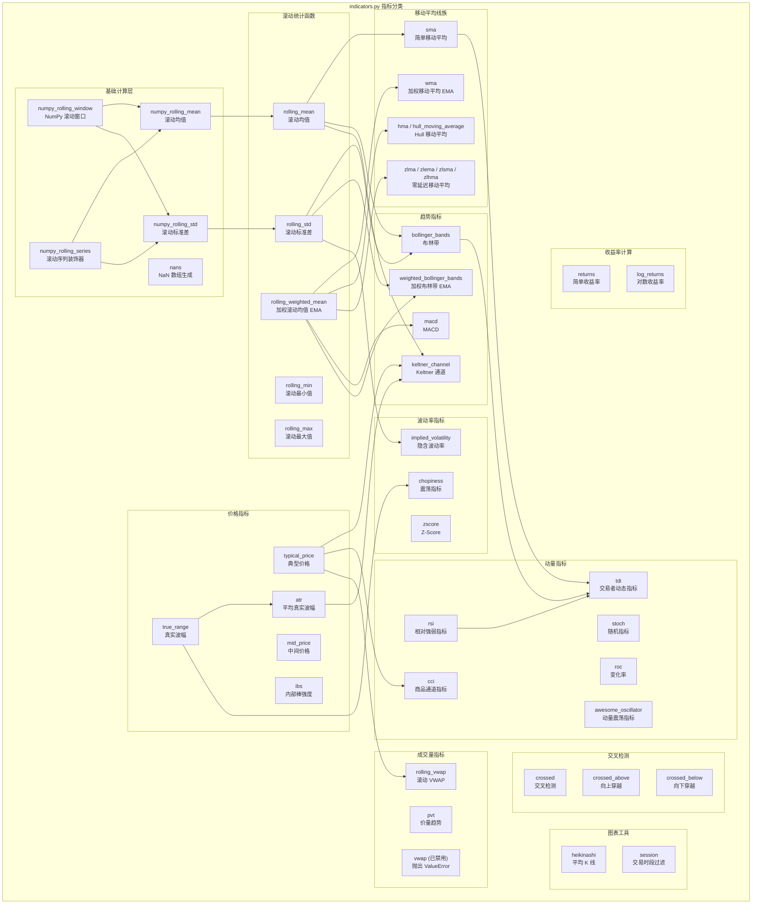
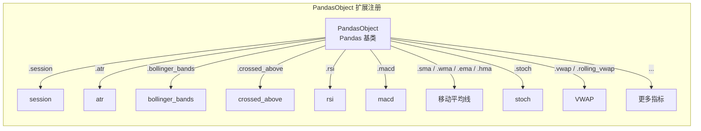
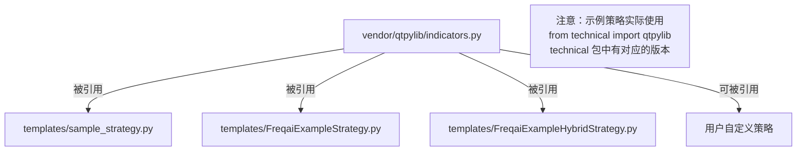
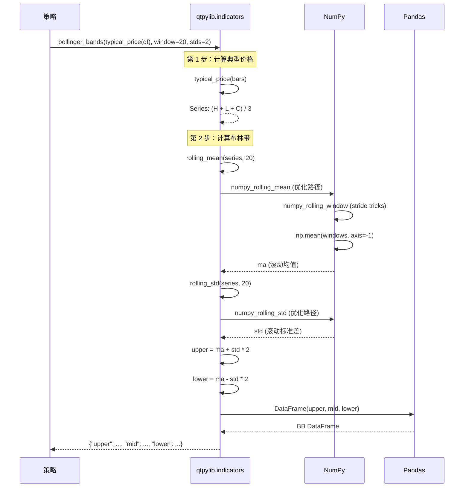
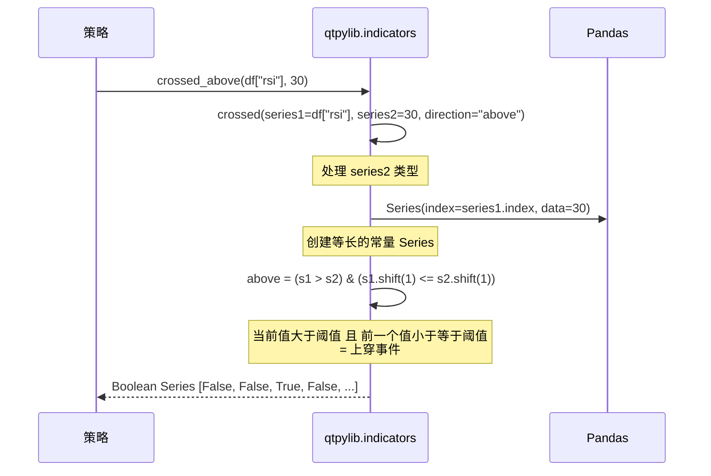
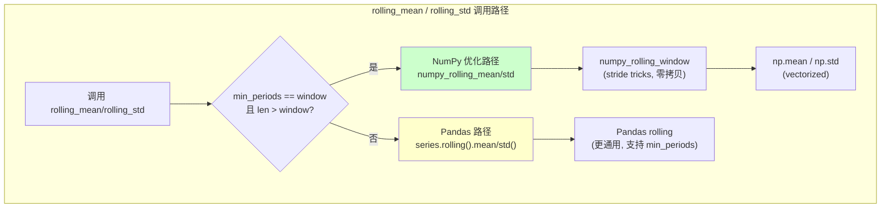

# Freqtrade Vendor QtPyLib -- 技术分析指标库

## 1. 模块概述

`freqtrade/vendor/qtpylib/` 是从 [QTPyLib](https://github.com/ranaroussi/qtpylib)（Quantitative Trading Python Library）项目 vendored 而来的技术分析指标库。该库由 Ran Aroussi 开发，采用 Apache License 2.0 许可证。

Freqtrade 从 QTPyLib 中提取了 `indicators.py` 模块，其中包含了丰富的技术分析指标和辅助函数。该模块完全基于 NumPy 和 Pandas 实现，不依赖 ta-lib 等 C 语言扩展库，具有良好的跨平台兼容性。

**核心特性：**
- **纯 Python 实现**：所有指标均基于 NumPy/Pandas 实现，无需编译 C 扩展
- **高性能 rolling 计算**：使用 NumPy stride tricks 优化的滚动窗口计算
- **PandasObject 扩展**：将指标函数注册为 Pandas 对象的方法，支持链式调用
- **完整的指标体系**：涵盖趋势指标、动量指标、波动率指标、成交量指标等多个类别
- **Lookahead Bias 防护**：禁用了可能导致前瞻偏差的 `vwap` 函数

## 2. 目录结构

```
freqtrade/vendor/qtpylib/
|-- __init__.py                  # 空初始化文件
|-- indicators.py                # 技术分析指标函数集合（核心文件，约 680 行）
```

## 3. 架构图





## 4. 核心类/函数说明

### 4.1 基础计算层

#### `numpy_rolling_window(data, window) -> ndarray`

使用 NumPy 的 stride tricks 创建高效的滚动窗口视图，无需复制数据。这是所有 rolling 计算的基础。

**原理：** 通过修改 ndarray 的 shape 和 strides 属性，创建一个二维"视图"，每行是原始数据的一个窗口切片。

```python
# 输入: [1, 2, 3, 4, 5], window=3
# 输出 (视图):
# [[1, 2, 3],
#  [2, 3, 4],
#  [3, 4, 5]]
```

#### `numpy_rolling_series(func)` -- 装饰器

将操作 ndarray 的函数包装为可以处理 Pandas Series 的函数。自动处理：
- Series -> ndarray 的转换
- NaN 填充（前 window-1 个值为 NaN）
- 可选地返回 Pandas Series（`as_source=True`）

#### `numpy_rolling_mean(data, window)` / `numpy_rolling_std(data, window)`

基于 `numpy_rolling_window` 的高效滚动均值和标准差实现。使用 `@numpy_rolling_series` 装饰器。

### 4.2 滚动统计函数

| 函数 | 签名 | 说明 |
|------|------|------|
| `rolling_mean` | `(series, window=200, min_periods=None)` | 滚动均值。数据量充足且 min_periods==window 时使用 NumPy 优化版本，否则回退到 Pandas `rolling().mean()` |
| `rolling_std` | `(series, window=200, min_periods=None)` | 滚动标准差（ddof=1）。同样的优化策略 |
| `rolling_min` | `(series, window=14, min_periods=None)` | 滚动最小值。使用 Pandas `rolling().min()` |
| `rolling_max` | `(series, window=14, min_periods=None)` | 滚动最大值。使用 Pandas `rolling().max()` |
| `rolling_weighted_mean` | `(series, window=200, min_periods=None)` | 指数加权移动平均（EWM），使用 Pandas `ewm(span=window).mean()` |

### 4.3 移动平均线族

| 函数 | 全称 | 计算方式 |
|------|------|---------|
| `sma(series, window)` | Simple Moving Average | `rolling_mean` 的别名 |
| `wma(series, window)` | Weighted Moving Average | `rolling_weighted_mean` 的别名（实际为 EMA） |
| `hma(series, window)` | Hull Moving Average | `2 * EMA(window/2) - EMA(window)` 再取 `EMA(sqrt(window))` |
| `zlma(series, window, kind)` | Zero Lag Moving Average | John Ehlers 零延迟均线：`2 * series - series.shift(lag)` 再取对应 MA |
| `zlema(series, window)` | Zero Lag EMA | `zlma` kind="ema" 的快捷方式 |
| `zlsma(series, window)` | Zero Lag SMA | `zlma` kind="sma" 的快捷方式 |
| `zlhma(series, window)` | Zero Lag HMA | `zlma` kind="hma" 的快捷方式 |

**Hull Moving Average 原理图：**

```
HMA(n) = WMA(sqrt(n)) of [2 * WMA(n/2) - WMA(n)]

步骤 1: 计算 WMA(n/2)
步骤 2: 计算 WMA(n)
步骤 3: 差值 = 2 * WMA(n/2) - WMA(n)
步骤 4: HMA = WMA(sqrt(n)) of 差值
```

### 4.4 趋势指标

#### `bollinger_bands(series, window=20, stds=2) -> DataFrame`

布林带指标，返回包含 `upper`、`mid`、`lower` 三列的 DataFrame。

```
upper = SMA(window) + stds * STD(window)
mid   = SMA(window)
lower = SMA(window) - stds * STD(window)
```

#### `weighted_bollinger_bands(series, window=20, stds=2) -> DataFrame`

加权布林带，使用 EMA 替代 SMA 作为中轨。

```
upper = EMA(window) + stds * STD(window)
mid   = EMA(window)
lower = EMA(window) - stds * STD(window)
```

#### `macd(series, fast=3, slow=10, smooth=16) -> DataFrame`

MACD (Moving Average Convergence/Divergence) 指标，返回包含 `macd`、`signal`、`histogram` 三列的 DataFrame。

```
macd_line = EMA(fast) - EMA(slow)
signal    = EMA(smooth) of macd_line
histogram = macd_line - signal
```

**注意：** 默认参数 (3, 10, 16) 与常见的 (12, 26, 9) 不同。

#### `keltner_channel(bars, window=14, atrs=2) -> DataFrame`

Keltner 通道指标，返回 `upper`、`mid`、`lower`。

```
mid   = SMA(typical_price, window)
upper = mid + ATR(window) * atrs
lower = mid - ATR(window) * atrs
```

### 4.5 动量指标

#### `rsi(series, window=14) -> Series`

相对强弱指标（RSI）的纯 Python 实现。使用 Wilder 平滑方法。

**算法：**
1. 计算价格变化量 `deltas = np.diff(series)`
2. 前 window+1 个变化量作为种子，分别计算上涨均值 `ups` 和下跌均值 `downs`
3. 对后续每个周期使用 Wilder 平滑递推：
   - `ups = (ups * (window-1) + upval) / window`
   - `downs = (downs * (window-1) + downval) / window`
4. `RSI = 100 - 100 / (1 + ups/downs)`

#### `stoch(df, window=14, d=3, k=3, fast=False) -> DataFrame`

随机指标（Stochastic Oscillator）。

**Fast Stochastic:**
```
fast_k = 100 * (close - rolling_min(low, window)) / (rolling_max(high, window) - rolling_min(low, window))
fast_d = SMA(fast_k, d)
```

**Slow Stochastic（默认）:**
```
slow_k = SMA(fast_k, k)
slow_d = SMA(slow_k, d)
```

#### `cci(series, window=14) -> Series`

商品通道指标（Commodity Channel Index）。

```
CCI = (typical_price - SMA(typical_price, window)) / (0.015 * STD(SMA))
```

#### `roc(series, window=14) -> Series`

变化率（Rate of Change）。

```
ROC = (price - price[n]) / price[n]
```

#### `awesome_oscillator(df, weighted=False, fast=5, slow=34) -> Series`

AO 动量震荡指标。

```
midprice = (high + low) / 2
AO = MA(midprice, fast) - MA(midprice, slow)
```
其中 MA 可以是 SMA（默认）或 EMA（`weighted=True`）。

#### `tdi(series, ...) -> DataFrame`

交易者动态指标（Traders Dynamic Index），组合了 RSI 和 Bollinger Bands。

返回 6 列：`rsi`、`rsi_signal`、`rsi_smooth`、`rsi_bb_upper`、`rsi_bb_lower`、`rsi_bb_mid`

### 4.6 价格指标

| 函数 | 公式 | 说明 |
|------|------|------|
| `typical_price(bars)` | `(H + L + C) / 3` | 典型价格，广泛用于其他指标的输入 |
| `mid_price(bars)` | `(H + L) / 2` | 中间价格 |
| `ibs(bars)` | `(C - L) / (H - L)` | 内部棒强度（Internal Bar Strength） |
| `true_range(bars)` | `max(H-L, |H-C_prev|, |L-C_prev|)` | 真实波幅 |
| `atr(bars, window=14, exp=False)` | `MA(true_range, window)` | 平均真实波幅（ATR），支持 SMA 或 EMA |

### 4.7 波动率指标

#### `implied_volatility(series, window=252) -> Series`

基于对数收益率计算的隐含波动率。

```
log_ret = log(price / price_prev)
IV = rolling_std(log_ret, window) * sqrt(window)
```

默认 window=252（约一年的交易日数）。

#### `zscore(bars, window=20, stds=1, col="close") -> Series`

Z-Score 标准化分数。

```
Z = (price - rolling_mean(price, window)) / (rolling_std(price, window) * stds)
```

#### `chopiness(bars, window=14) -> Series`

震荡指标（Choppiness Index），衡量市场是否处于震荡状态。

```
CHOP = 100 * log10(sum(true_range, window) / (highest_high - lowest_low)) / log10(window)
```

### 4.8 成交量指标

#### `rolling_vwap(bars, window=200) -> Series`

滚动成交量加权平均价格（Rolling VWAP）。

```
VWAP = sum(volume * typical_price, window) / sum(volume, window)
```

使用滚动窗口计算，避免 lookahead bias。无穷大值替换为 NaN 并前向填充。

#### `vwap(bars)` -- 已禁用

全量 VWAP 计算。**该函数已被 Freqtrade 禁用**，调用时直接抛出 `ValueError`：

```
using `qtpylib.vwap` facilitates lookahead bias. Please use
`qtpylib.rolling_vwap` instead, which calculates vwap in a rolling manner.
```

**禁用原因：** 全量 VWAP 使用 `np.cumsum` 从数据起始到当前的累积计算，在回测中会使用到"未来"的数据，导致前瞻偏差。

#### `pvt(bars) -> Series`

价量趋势（Price Volume Trend）。

```
PVT = cumsum((close - close_prev) / close_prev * volume)
```

### 4.9 交叉检测

#### `crossed(series1, series2, direction=None) -> Series`

检测两个序列的交叉事件。

| 参数 | 说明 |
|------|------|
| `direction=None` | 返回任意方向的交叉（上穿或下穿） |
| `direction="above"` | 仅返回上穿事件 |
| `direction="below"` | 仅返回下穿事件 |

**交叉判定逻辑：**
```
上穿 (above): series1 > series2 且 series1_prev <= series2_prev
下穿 (below): series1 < series2 且 series1_prev >= series2_prev
```

#### `crossed_above(series1, series2)` / `crossed_below(series1, series2)`

`crossed()` 的便捷封装。这两个函数在 Freqtrade 策略中使用最为频繁，用于检测指标穿越信号。

```python
# 策略中的典型用法
(qtpylib.crossed_above(dataframe["rsi"], 30))  # RSI 向上穿越 30
(qtpylib.crossed_below(dataframe["rsi"], 70))  # RSI 向下穿越 70
```

### 4.10 图表工具

#### `heikinashi(bars) -> DataFrame`

将标准 OHLC K 线转换为平均 K 线（Heikin-Ashi）。

```
ha_close = (O + H + L + C) / 4
ha_open[0] = (O[0] + C[0]) / 2
ha_open[i] = (ha_open[i-1] + ha_close[i-1]) / 2
ha_high = max(H, ha_open, ha_close)
ha_low = min(L, ha_open, ha_close)
```

#### `session(df, start="17:00", end="16:00") -> DataFrame`

过滤 DataFrame 以只保留指定交易时段的数据。支持跨日时段（如期货市场的 17:00-16:00）。

### 4.11 收益率计算

| 函数 | 公式 | 说明 |
|------|------|------|
| `returns(series)` | `price / price_prev - 1` | 简单收益率 |
| `log_returns(series)` | `log(price / price_prev)` | 对数收益率 |

两者都会将 `inf` 和 `-inf` 替换为 NaN。

### 4.12 PandasObject 扩展

文件末尾将所有主要指标函数注册为 `PandasObject` 的方法，使得任何 Pandas Series 或 DataFrame 都可以直接调用这些指标：

```python
# 函数式调用
result = bollinger_bands(dataframe["close"], window=20, stds=2)

# PandasObject 扩展调用（等价）
result = dataframe["close"].bollinger_bands(window=20, stds=2)
```

**完整的注册列表（共 37 个方法）：**

| 类别 | 方法 |
|------|------|
| 交易时段 | session |
| 波动率 | atr, true_range, implied_volatility |
| 布林带 | bollinger_bands, weighted_bollinger_bands |
| 动量 | rsi, cci, stoch, roc, tdi, chopiness |
| 价格 | typical_price, mid_price, ibs |
| 交叉 | crossed, crossed_above, crossed_below |
| K 线 | heikinashi |
| 移动平均 | sma, wma, ema(=wma), hma, hull_moving_average |
| 零延迟均线 | zlma, zlema, zlsma, zlhma, zlwma(=zlema) |
| MACD | macd |
| 统计 | rolling_mean, rolling_std, rolling_min, rolling_max, rolling_weighted_mean, zscore |
| 成交量 | vwap, rolling_vwap, pvt |
| 收益率 | returns, log_returns |

**注意：** `ema` 实际映射到 `wma`（即 EWM），`zlwma` 映射到 `zlema`。

## 5. 依赖关系

### 外部依赖

| 库 | 模块 | 用途 |
|----|------|------|
| `numpy` | 全文件 | 数组运算、stride tricks、数学函数（log, sqrt, exp 等） |
| `pandas` | 全文件 | Series/DataFrame 操作、rolling 窗口、PandasObject 扩展 |
| `warnings` | 文件头 | 抑制 RuntimeWarning |
| `datetime` | session 函数 | 日期时间计算 |

### 被依赖关系



## 6. 数据流

### 指标计算数据流



### 交叉检测数据流



### 性能优化路径



NumPy 优化路径通过 stride tricks 避免数据复制，在大数据量场景下性能显著优于 Pandas 的 rolling 方法。选择条件是 `min_periods == window` 且数据长度大于窗口大小。
