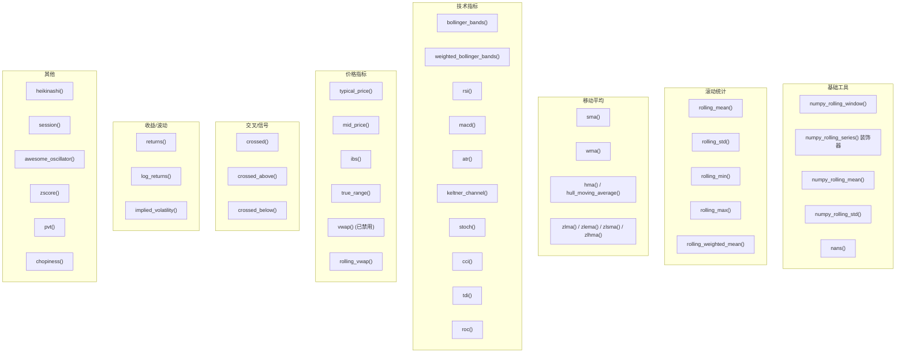

# indicators.py (vendor/qtpylib)

## 概述
`freqtrade/vendor/qtpylib/indicators.py` 是来自 QTPyLib（Quantitative Trading Python Library）的技术分析指标集合，原始代码由 Ran Aroussi 开发（Apache 2.0 许可证）。Freqtrade 将其纳入 vendor 目录并进行了一些定制。该文件提供了 40+ 个技术指标和辅助函数，涵盖趋势、动量、波动率、成交量等类别，并将所有函数注册为 Pandas 对象的方法，方便链式调用。

## 架构图


## 核心类/函数

### 基础工具函数

#### numpy_rolling_window(data, window)
使用 NumPy stride tricks 创建滑动窗口视图，高效计算滚动统计量。不复制数据，仅改变数据的 strides。

#### numpy_rolling_series(func) -- 装饰器
将基于 NumPy 数组的滚动计算函数包装为支持 Pandas Series 的版本。处理 NaN 填充并可选返回 Pandas Series。

#### numpy_rolling_mean(data, window) / numpy_rolling_std(data, window)
使用 NumPy 实现的滚动均值/标准差，比 Pandas 内置实现更快。

### 滚动统计函数

#### rolling_mean(series, window=200, min_periods=None)
滚动均值。当条件满足时优先使用 NumPy 实现，否则回退到 Pandas rolling。

#### rolling_std(series, window=200, min_periods=None)
滚动标准差。逻辑同 `rolling_mean`。

#### rolling_min/rolling_max(series, window=14, min_periods=None)
滚动最小值/最大值，使用 Pandas rolling 实现。

#### rolling_weighted_mean(series, window=200, min_periods=None)
指数加权移动均值（EWM），使用 `span` 参数。

### 移动平均线

#### sma(series, window=200) -- 简单移动平均
`rolling_mean` 的别名。

#### wma(series, window=200) -- 加权移动平均
`rolling_weighted_mean` 的别名（实际上是 EMA）。

#### hma(series, window=200) / hull_moving_average(series, window=200)
Hull 移动平均线：`WMA(2*WMA(n/2) - WMA(n), sqrt(n))`，响应速度更快、延迟更低。

#### zlma(series, window=20, kind="ema") -- 零延迟移动平均
John Ehlers 的零延迟移动平均线。支持 ema、hma、sma 三种模式。

#### zlema/zlsma/zlhma -- zlma 的便捷包装
分别调用 `zlma` 并指定不同的 `kind` 参数。

### 技术指标

#### bollinger_bands(series, window=20, stds=2) -> DataFrame
标准布林带（基于 SMA），返回包含 `upper`、`mid`、`lower` 列的 DataFrame。

#### weighted_bollinger_bands(series, window=20, stds=2) -> DataFrame
加权布林带（基于 EMA），返回 `upper`、`mid`、`lower`。

#### rsi(series, window=14) -> Series
相对强弱指数（RSI）。使用经典的 Wilder 平滑方法实现。

#### macd(series, fast=3, slow=10, smooth=16) -> DataFrame
MACD 指标，返回 `macd`（快线-慢线）、`signal`（信号线）、`histogram`（柱状图）。

#### atr(bars, window=14, exp=False) -> Series
平均真实范围（ATR）。`exp=True` 时使用指数平滑，否则使用简单平均。

#### keltner_channel(bars, window=14, atrs=2) -> DataFrame
Keltner Channel，基于典型价格均值 +/- ATR 倍数，返回 `upper`、`mid`、`lower`。

#### stoch(df, window=14, d=3, k=3, fast=False) -> DataFrame
Stochastic Oscillator（随机振荡器）。`fast=True` 返回 fast_k/fast_d，否则返回 slow_k/slow_d。

#### cci(series, window=14) -> Series
商品通道指数（CCI）。

#### tdi(series, rsi_lookback=13, ...) -> DataFrame
Traders Dynamic Index（交易者动态指数），包含 RSI、RSI 信号线、RSI 平滑线和 RSI 布林带。

#### roc(series, window=14) -> Series
变化率（Rate of Change）。

### 价格/成交量指标

#### typical_price(bars) -> Series
典型价格：`(high + low + close) / 3`。

#### mid_price(bars) -> Series
中间价格：`(high + low) / 2`。

#### ibs(bars) -> Series
Internal Bar Strength（内部棒线强度）：`(close - low) / (high - low)`。

#### true_range(bars) -> Series
真实范围：`max(high-low, |high-prev_close|, |low-prev_close|)`。

#### vwap(bars) -- 已禁用
成交量加权平均价格。**此函数已被禁用**，会抛出 `ValueError`，提示使用 `rolling_vwap` 代替（因为原始 VWAP 存在前瞻偏差问题）。

#### rolling_vwap(bars, window=200) -> Series
滚动 VWAP，避免前瞻偏差。计算公式：`sum(volume * typical_price) / sum(volume)` 在窗口内。

### 交叉信号函数

#### crossed(series1, series2, direction=None) -> Series
检测两个序列的交叉。`direction=None` 检测任意方向交叉，`"above"` 检测上穿，`"below"` 检测下穿。

#### crossed_above(series1, series2) -> Series
`crossed(series1, series2, "above")` 的便捷包装。在策略中最常用。

#### crossed_below(series1, series2) -> Series
`crossed(series1, series2, "below")` 的便捷包装。

### 收益/波动率函数

#### returns(series) -> Series
简单收益率：`price / prev_price - 1`。

#### log_returns(series) -> Series
对数收益率：`ln(price / prev_price)`。

#### implied_volatility(series, window=252) -> Series
隐含波动率：对数收益率的滚动标准差乘以 `sqrt(window)`。

### 其他指标

#### heikinashi(bars) -> DataFrame
Heikin Ashi 蜡烛图转换。将标准 OHLC 转换为平滑后的 HA OHLC。

#### session(df, start="17:00", end="16:00")
按交易时段过滤数据（移除前一个 Globex 交易日的数据）。

#### awesome_oscillator(df, weighted=False, fast=5, slow=34) -> Series
Awesome Oscillator：快速 SMA(midprice) - 慢速 SMA(midprice)。

#### zscore(bars, window=20, stds=1, col="close") -> Series
Z-Score：`(price - mean) / (std * stds)`，衡量价格偏离均值的程度。

#### pvt(bars) -> Series
Price Volume Trend（价量趋势）：累积价格变化百分比乘以成交量。

#### chopiness(bars, window=14) -> Series
Choppiness Index（震荡指数）：衡量市场是趋势还是横盘。

### PandasObject 方法注册
文件末尾将所有主要函数注册为 `PandasObject` 的方法，使得可以直接在 DataFrame/Series 上链式调用：
```python
df.bollinger_bands(window=20, stds=2)
df.rsi(window=14)
series.crossed_above(other_series)
```

## 依赖关系

### 内部依赖（本项目模块）
无

### 外部依赖（第三方库）
- `numpy` -- 数值计算，stride tricks
- `pandas` -- 数据结构（DataFrame, Series）
- `pandas.core.base.PandasObject` -- 用于注册自定义方法

### 被依赖（谁引用了本文件）
此文件为 vendor 代码，项目中实际使用的是 `technical` 包中的 `qtpylib`（`from technical import qtpylib`），而非直接引用此 vendor 版本。此文件作为参考和备份保留在项目中。
