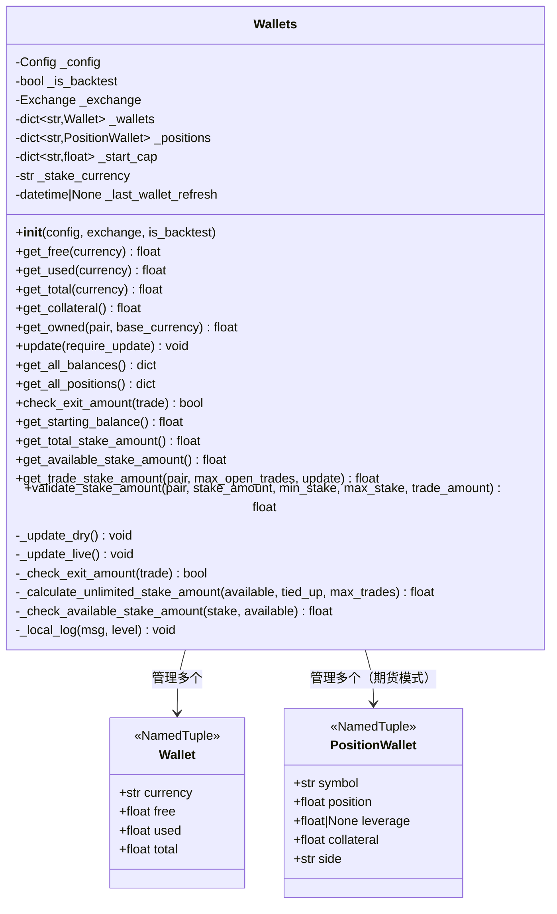

# wallets.py

## 概述
`freqtrade/wallets.py` 管理 bot 的钱包和持仓状态，包括可用余额、已用余额、总余额的跟踪，以及交易资金的计算和验证。它支持现货和期货两种交易模式，支持模拟运行（dry-run）和实盘两种数据源。Wallets 类是资金管理的核心组件，负责在每次交易循环中同步余额信息，并为入场决策提供资金可用性验证。

## 架构图

## 核心类

### Wallet (NamedTuple)
- **字段**:
  - `currency: str` — 币种名称
  - `free: float` — 可用余额（默认 0）
  - `used: float` — 冻结/已用余额（默认 0）
  - `total: float` — 总余额（默认 0）

### PositionWallet (NamedTuple)
- **字段**:
  - `symbol: str` — 交易对符号
  - `position: float` — 持仓数量（默认 0）
  - `leverage: float | None` — 杠杆倍数（不保证可用，默认 0）
  - `collateral: float` — 保证金（默认 0）
  - `side: str` — 方向，"long" 或 "short"（默认 "long"）

### Wallets

#### `__init__(self, config, exchange, is_backtest=False)`
- **参数**:
  - `config`: 配置字典
  - `exchange`: Exchange 实例
  - `is_backtest`: 是否为回测模式
- **初始化逻辑**:
  - 从 exchange 获取代理币种（proxy coin）作为 stake_currency
  - 解析 `dry_run_wallet` 配置：支持单一数值（应用于 stake_currency）或多币种字典
  - 立即调用 `update()` 同步钱包状态

#### `update(self, require_update: bool = True) -> None`
- **职责**: 刷新钱包余额
- **逻辑**:
  - 当 `require_update=True` 或上次刷新超过 1 小时时执行更新
  - 根据运行模式调用 `_update_live()`（实盘）或 `_update_dry()`（模拟）

#### `_update_dry(self) -> None`
- **职责**: 从数据库更新模拟运行模式下的钱包状态
- **计算逻辑**:
  - 获取已关闭交易的总利润
  - 获取未平仓交易的实现利润和占用资金
  - **现货模式**: 为每个交易中的币种计算 free/used/total 余额，考虑挂单金额
  - **期货模式**: 为每个持仓创建 PositionWallet
  - **Cross-margin 模式**: 将其他币种的余额按汇率折算到 stake_currency 的 free 余额中
  - 计算 stake_currency 的当前余额 = 起始资金 + 总利润 - 占用资金

#### `_update_live(self) -> None`
- **职责**: 从交易所 API 获取实时余额和持仓信息
- **逻辑**: 调用 `exchange.get_balances()` 和 `exchange.fetch_positions()`，解析为 Wallet 和 PositionWallet 对象

#### `get_free(currency) / get_used(currency) / get_total(currency)`
- **职责**: 获取指定币种的可用/已用/总余额，不存在时返回 0

#### `get_collateral(self) -> float`
- **职责**: 获取总保证金（用于清算价格计算）
- **Cross-margin 模式**: free 余额 + 所有持仓保证金之和
- **其他模式**: stake_currency 的 total 余额

#### `get_owned(self, pair, base_currency) -> float`
- **职责**: 获取当前拥有的某个交易对的数量。现货模式查 base_currency 总余额，期货模式查持仓

#### `get_trade_stake_amount(self, pair, max_open_trades, update=True) -> float`
- **职责**: 计算单笔交易的下注金额
- **逻辑**:
  - 更新钱包余额
  - 如果配置为 "unlimited"，调用 `_calculate_unlimited_stake_amount()` 均分可用资金
  - 否则使用配置的固定金额
  - 最后通过 `_check_available_stake_amount()` 验证余额是否充足

#### `_calculate_unlimited_stake_amount(self, available, val_tied_up, max_open_trades) -> float`
- **职责**: "unlimited" 模式下的资金分配计算
- **公式**: `(available + tied_up) / max_open_trades`，但不超过 available

#### `validate_stake_amount(self, pair, stake_amount, min_stake, max_stake, trade_amount) -> float`
- **职责**: 验证并调整下注金额，确保在最小/最大限制范围内
- **逻辑**:
  - 如果金额无效（None、0、负数、字符串）返回 0
  - 如果低于最小金额，在 +30% 范围内向上调整到最小金额，否则跳过
  - 如果超过最大可用金额，向下调整
  - 考虑已有持仓（`trade_amount`）对最大允许金额的影响

#### `check_exit_amount(self, trade) -> bool`
- **职责**: 检查钱包中是否有足够余额执行平仓。如果首次检查不通过，会强制刷新钱包后再检查一次

#### `get_starting_balance(self) -> float`
- **职责**: 获取起始余额。如果配置了 `available_capital` 直接返回；否则通过当前余额反推

#### `get_total_stake_amount(self) -> float`
- **职责**: 获取总可交易金额 = (未平仓占用 + 可用余额) * tradable_balance_ratio

#### `get_available_stake_amount(self) -> float`
- **职责**: 获取当前可用于新交易的金额 = min(总可交易 - 已占用, 可用余额)

#### `_local_log(self, msg, level="info") -> None`
- **职责**: 条件日志输出，在回测模式下不输出日志以提升性能

## 依赖关系

### 内部依赖（本项目模块）
- `freqtrade.constants` — UNLIMITED_STAKE_AMOUNT, Config, IntOrInf
- `freqtrade.enums` — RunMode, TradingMode
- `freqtrade.exceptions` — DependencyException
- `freqtrade.exchange.Exchange` — 交易所接口，获取余额和持仓
- `freqtrade.misc` — safe_value_fallback
- `freqtrade.persistence` — LocalTrade, Trade（数据库模型）
- `freqtrade.util.datetime_helpers` — dt_now

### 外部依赖（第三方库）
- `logging` — 日志记录
- `datetime` — 时间戳处理
- `typing` — NamedTuple, Literal 类型注解

### 被依赖（谁引用了本文件）
- `freqtrade.freqtradebot` — 创建 Wallets 实例并在交易流程中广泛使用
- `freqtrade.optimize.backtesting` — 回测中的资金管理
- `freqtrade.rpc.rpc` — 通过 RPC 暴露钱包信息
- `freqtrade.strategy.interface` — 策略中访问钱包余额
- `freqtrade.leverage.liquidation_price` — 清算价格计算使用保证金信息
