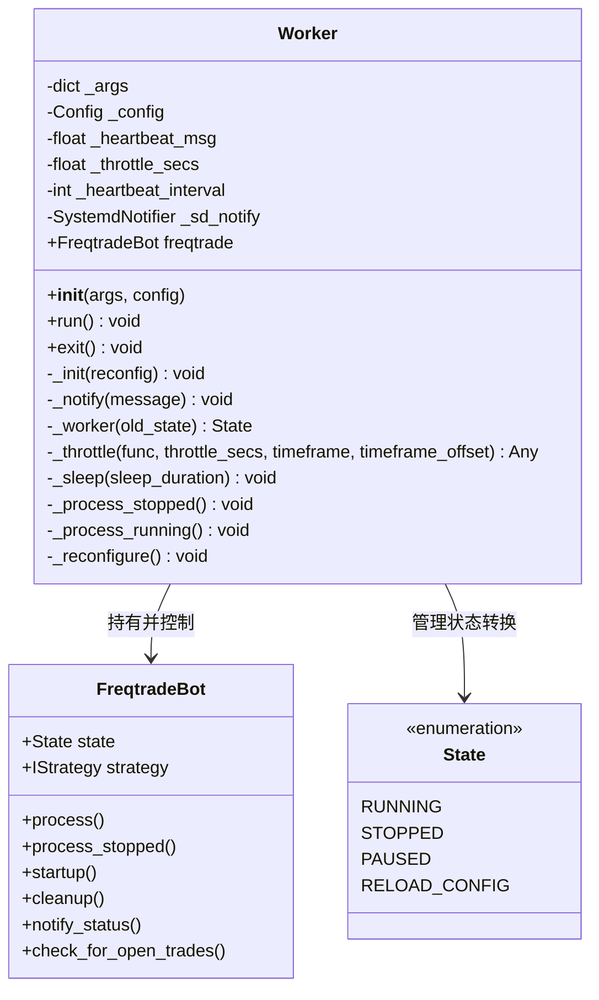
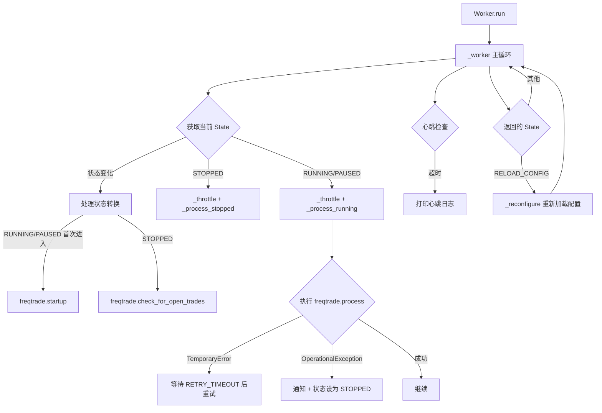

# worker.py

## 概述
`freqtrade/worker.py` 定义了 `Worker` 类，它是 freqtrade bot 的主工作循环控制器。Worker 负责管理 bot 的生命周期状态（STOPPED / RUNNING / PAUSED / RELOAD_CONFIG），通过节流机制控制主循环执行频率，处理状态转换、心跳日志、systemd 通知以及配置热重载。Worker 封装了 `FreqtradeBot` 实例，是 bot 运行的最外层框架。

## 架构图

## 核心类

### Worker

#### `__init__(self, args: dict[str, Any], config: Config | None = None) -> None`
- **参数**:
  - `args`: 命令行参数字典
  - `config`: 可选的预加载配置
- **职责**: 初始化所有变量和对象。调用 `_init(False)` 创建 FreqtradeBot 实例，初始化心跳时间戳，通知 systemd 初始化完成

#### `_init(self, reconfig: bool) -> None`
- **参数**: `reconfig` — 是否为重新配置（True 时重新加载配置文件）
- **职责**:
  - 当 `reconfig=True` 或 `_config=None` 时，从命令行参数重新加载配置
  - 创建新的 `FreqtradeBot` 实例
  - 从配置中读取 `process_throttle_secs`（默认 5 秒）和 `heartbeat_interval`（默认 60 秒）
  - 根据配置决定是否启用 systemd 通知

#### `run(self) -> None`
- **职责**: bot 的无限主循环。反复调用 `_worker()`，当状态为 `RELOAD_CONFIG` 时触发 `_reconfigure()`

#### `_worker(self, old_state: State | None) -> State`
- **参数**: `old_state` — 上一次迭代的状态
- **返回值**: 当前状态
- **职责**: 主循环的每次迭代逻辑：
  1. 获取当前状态
  2. 如果状态发生变化，记录日志并处理转换（如首次进入 RUNNING 时调用 `startup()`，进入 STOPPED 时检查未平仓交易）
  3. 根据状态调用不同的处理函数（通过 `_throttle` 控制执行频率）
  4. 执行心跳检查，定期输出 PID、版本、策略版本和状态信息

#### `_throttle(self, func, throttle_secs, timeframe=None, timeframe_offset=1.0, *args, **kwargs) -> Any`
- **参数**:
  - `func`: 要执行的可调用对象
  - `throttle_secs`: 最小执行间隔（秒）
  - `timeframe`: K 线时间框架字符串，用于确保在新 K 线到达时开始迭代
  - `timeframe_offset`: 新 K 线偏移量（秒），默认 1.0
- **返回值**: func 的执行结果
- **职责**: 节流控制机制。执行 func 后计算需要 sleep 的时间，确保每次迭代至少花费 `throttle_secs` 秒。如果指定了 timeframe，还会对齐到 K 线周期边界

#### `_process_running(self) -> None`
- **职责**: RUNNING/PAUSED 状态下的处理逻辑。调用 `freqtrade.process()`，捕获并处理 `TemporaryError`（等待后重试）和 `OperationalException`（通知用户并停止 bot）

#### `_process_stopped(self) -> None`
- **职责**: STOPPED 状态下的处理逻辑。调用 `freqtrade.process_stopped()`

#### `_reconfigure(self) -> None`
- **职责**: 配置热重载：
  1. 通知 systemd 正在重新配置
  2. 清理当前 freqtrade 实例
  3. 重新加载配置并创建新的 FreqtradeBot 实例
  4. 发送重配置完成的状态通知
  5. 通知 systemd 重配置完成

#### `_notify(self, message: str) -> None`
- **职责**: 向 systemd 发送通知消息（如果启用了 sd_notify）

#### `exit(self) -> None`
- **职责**: 优雅退出。通知 systemd 正在停止，发送 RPC 通知，调用 FreqtradeBot 的 cleanup 方法

#### `_sleep(sleep_duration: float) -> None` (静态方法)
- **职责**: 封装 `time.sleep()`，便于测试时 mock

## 依赖关系

### 内部依赖（本项目模块）
- `freqtrade.__version__` — 版本号，用于心跳日志
- `freqtrade.configuration.Configuration` — 配置加载
- `freqtrade.constants` — PROCESS_THROTTLE_SECS, RETRY_TIMEOUT, Config
- `freqtrade.enums` — RPCMessageType, State
- `freqtrade.exceptions` — OperationalException, TemporaryError
- `freqtrade.exchange.timeframe_to_next_date` — K 线时间对齐
- `freqtrade.freqtradebot.FreqtradeBot` — 核心交易机器人类

### 外部依赖（第三方库）
- `sdnotify` — systemd 通知（sd_notify 协议）
- `time` — 时间相关操作
- `logging` — 日志记录
- `traceback` — 异常堆栈格式化

### 被依赖（谁引用了本文件）
- `freqtrade.commands.trade_commands` — 创建 Worker 实例来启动交易
- `tests/freqtradebot/test_worker.py` — Worker 单元测试
- `tests/conftest.py` — 测试 fixtures
